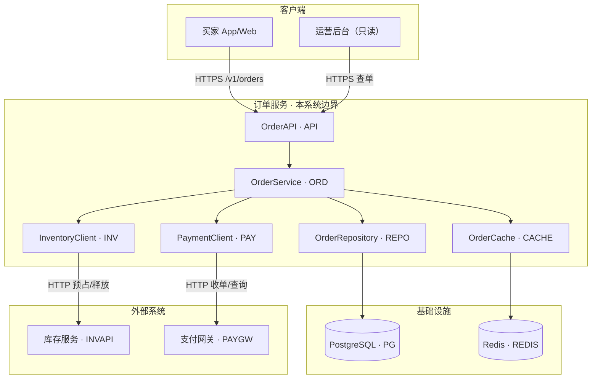

# design-spec.md — Design Doc（人读）格式规范

> **状态：** 定稿 · [artifact-templates 索引](./README.md)  
> **配套规范：** [prd-spec.md](./prd-spec.md) · [flow-spec.md](./flow-spec.md) · [review-spec.md](./review-spec.md)  
> **标准基线：** [Google Engineering Practices — Design Docs](https://google.github.io/eng-practices/)  
> **节点交接以：** [`../artifact-schemas/design-spec.md`](../artifact-schemas/design-spec.md)（`DesignArtifact` / `design.json`）**为准**；本文件定义 Run `design.md` 的章节与写法。  
> **Run 路径：** `docs/runs/<task_id>/design.md`  
> **配套图：** [flow-spec.md](./flow-spec.md) → Run 的 `*.mmd`  
> **校验：** JSON → [quality-gates.md §4](../quality-gates.md#4-design_validate--规则清单)；MD → §4.3（P1）

---

## 文档定位

| 对比 | Run `spec.md`（[prd-spec.md](./prd-spec.md)） | Run `design.md`（本规范） |
|------|---------|-----------|
| 回答 | 做什么、验收什么（[prd-spec.md](./prd-spec.md)） | 怎么做、依赖什么、数据怎么存、异常怎么处理（本文） |
| 读者 | PM、HITL | Architect、Developer、QA、Reviewer |
| **Run 语言** | **中文**（[prd-spec.md](./prd-spec.md)） | **中文**（本文） |

**正文 §1–§10** = Google 式 Design Doc + **七项工程必备**（外部依赖、**模块 API**、表结构、Flow 图、测试用例、事务一致性、错误码）。  
**不含** 上线/部署（Rollout & Deployment）——由 Platform / 运维 / CI 流水线单独承载，Architect **不在本文设计**。  
**附录 A–E** = Agent 流水线实现蓝图。

### 语言与格式（Run `design.md`）

| 项 | 约定 |
|----|------|
| **正文语言** | **中文** — 章节标题、段落、表头、说明与 HITL 可读叙述 |
| **保留英文** | 标识符与契约：`FEAT-*` / `US-*` / `REQ-*` / `AC-*`、`ERR-*` / `TC-*`、`code_domain`、模块/类名、文件路径、HTTP path、JSON 字段名、枚举字面量 |
| **章节标题** | 固定 **中文 + 编号**（见下表）；与 [prd-spec.md](./prd-spec.md) 一致，Run 人读文档统一中文 |
| **页眉** | `# 设计文档 — {title}`；元数据标签用中文（版本 / 对应需求 / 状态） |
| **图表** | Mermaid 节点说明宜中文；participant 名须与 §4.2 模块名一致（`DES-204`） |

> 本规范正文以 **§ 编号** 交叉引用；Agent 渲染 Run `design.md` 时 **须输出下表中文章节标题**（非英文旧称）。

---

## 固定章节

**正文 §1–§10** 与 **附录 A–E** 均为固定结构；**测试用例不在正文单独占 § 号**，而是 **§8 策略 + 附录 D 用例清单** 配套（见下表）。

### 正文

| § | Markdown 标题 | 对应 JSON | 必填 |
|---|---------------|-----------|------|
| — | `# 设计文档 — {title}` | 元数据 | ✓ |
| 1 | `## 1. 背景与上下文` | `summary`、`background?`、`context_view` | ✓ |
| 2 | `## 2. 设计目标` | `design_goals[]`、`constraints_ref[]` | ✓ |
| 3 | `## 3. 非目标` | `non_goals[]` | ✓ |
| 4 | `## 4. 方案设计` | 见 §4 子节 | ✓ |
| 5 | `## 5. 方案对比` | `decisions[]` | ✓（**2 个方案即可**：1 选用 + 1 拒绝） |
| 6 | `## 6. 横切关注点` | `cross_cutting`、`transaction_constraints[]`、`error_catalog[]` | ✓ |
| 7 | `## 7. 性能与可靠性` | `non_functional[]` | 条件* |
| 8 | `## 8. 测试计划` | `test_strategy` | ✓（**策略**；用例明细 → **附录 D**，**须含异常 + 边界**） |
| 9 | `## 9. 监控与告警` | `monitoring?`、`cross_cutting.observability?` | 条件* |
| 10 | `## 10. 待澄清项` | `open_items[]`、`risks[]` | ✓ |

> **不写：** ~~`## 9. Rollout & Deployment`~~ — Design Doc **不涵盖** 灰度、K8s 清单、发布回滚等；[`design.json`](../artifact-schemas/design-spec.md) 的 `deployment` / `rollout` **留空或不输出**（与 Platform 文档分工）。

### §4 方案设计 — 固定子节

| 子节 | 标题 | JSON | 必填 |
|------|------|------|------|
| 4.1 | `### 4.1 概述` | `architecture` | ✓ |
| 4.2 | `### 4.2 模块划分` | `modules[]`（含 **`code_domain`**） | ✓ |
| 4.3 | `### 4.3 外部依赖` | `external_dependencies[]`（含 **`code_domain`**） | ✓ |
| 4.4 | `### 4.4 接口定义` | `interfaces[]` → **`operations[]`** | ✓ |
| 4.5 | `### 4.5 数据模型与表结构` | `data_model[]`、`table_schemas[]` | ✓ |
| 4.6 | `### 4.6 流程与时序` | `diagrams[]` → `*.mmd` | ✓ |

\* §7：承接 prd-spec **§9**（`operational_profile` / `consistency_profile`，**非**本文 §9）。§7 非 trivial 时必填。  
\* **design §9**（监控与告警）：长运行服务 / 可观测性有要求时填写；本地 CLI 可 **不适用**。

### 附录

| 附录 | 标题 | JSON | 必填 |
|------|------|------|------|
| A | `## 附录 A. 需求追溯` | `traceability[]` | ✓ |
| B | `## 附录 B. 文件变更计划` | `file_plan[]` | ✓ |
| C | `## 附录 C. 开发任务分解` | `dev_tasks[]` | ✓ |
| D | `## 附录 D. 测试用例设计` | `test_cases[]` + `test_strategy.paths` | ✓（**必含：正向 + 异常 + 边界**；与 §8 配套） |
| E | `## 附录 E. 与现有代码对照` | `code_delta` | ✓ |

**页眉（推荐）：** `# 设计文档 — {title}` + **版本** / **对应需求** / **状态** / Supersedes（后一项可选，英文键名可保留在 JSON）

---

## 各节写法

### §1 背景与上下文

- **summary**：1–3 句说明本设计解决什么。
- **context_view**：`actors[]`（谁用）、`external_systems[]`（边界上的外部实体，**角色级**）。
- 与 §4.3 分工：§1 不写连接串/版本；§4.3 写可实施依赖。

### §2 设计目标 / §3 非目标

- **设计目标（§2）**：可验证目标，引用 spec `FEAT-*` / `AC-*`；若有 prd-spec §4 业务指标（`success_metrics`）可引用 `KPI-*`（可选）。
- **非目标（§3）**：显式排除项，与 spec `scope_out` 对齐；**不要**重复 prd-spec §2 术语定义全文。

### §4.1 概述

- `architecture.solution_strategy`：一句话架构；`style`（layered / pipeline / …）。
- **全局架构图**（§4.2 模块 ≥2 或 §4.3 有外部依赖时 **推荐必填**）：`architecture-*.mmd`，登记 `diagrams[]` · `kind: context`；展示 **本系统边界内模块** 与 **外部依赖** 静态拓扑（答「谁连谁」）。
- 与 §4.6 分工：**context** = 结构；**sequence / flowchart** = 按 `US-*` 的请求路径与分支。
- 细节在 §4.2–§4.4。

### §4.2 模块划分（模块与 code_domain）

表格推荐：

| 模块 | 路径 | 职责 | **code_domain** | 依赖模块 |
|------|------|------|-----------------|----------|

- **一模块一域**：每个 `modules[]` 须有 **唯一** `code_domain`（大写缩写，2–12 字符）。
- **封装外部 IO：** 访问 Redis / DB / HTTP 等宜经 **Repository / Client / Cache 模块**；架构图与 `depends_on` 中 **Service 不直连** 外部中间件（与 §4.3 `code_domain` 分工一致）。
- 模块内抛出的错误 → `ERR-{code_domain}-{序号}`；测该模块 → `TC-{HAP|NEG|BND}-{code_domain}-{序号}`（格式见 [编码规范](#编码规范错误码--测试用例)）。
- JSON：`modules[]` → `{ "name", "path", "responsibility", "code_domain", "depends_on"?: [] }`

### §4.3 外部依赖

回答：**依赖哪些 DB、缓存、消息队列、RPC、第三方 HTTP 等**（无则显式写「无外部中间件」）。

表格推荐：

| 名称 | 类型 | 技术/版本 | 用途 | 连接/端点 | **code_domain** | 关键性 |
|------|------|-----------|------|-----------|-----------------|--------|

**`kind` 枚举：** `db` | `cache` | `mq` | `rpc` | `api` | `filesystem` | `blockchain` | `none`

- **DB**：PostgreSQL、MySQL、SQLite…  
- **Cache**：Redis、Memcached…  
- **其它服务**：内部 gRPC、DEX RPC、Stripe API 等  
- 须说明 **故障时行为**（降级 / 失败 / 重试）— 可与 §6 错误码呼应  
- **`code_domain`（必填，例外见下）**：错误码/测试域前缀（见 [域前缀注册](#域前缀注册42--43)）
  - **`db`/`cache`/`mq`/`rpc`/`api`/`blockchain`**：独立域，不得与模块或其它非 `filesystem` 依赖重复（`DES-028`）
  - **`filesystem`**：须 **等于** 封装该 IO 的某模块 `code_domain`（如 `todos.json`→`STORE`）
  - **`none`**（无外部中间件占位）：**省略** `code_domain`（`DES-028`）

JSON：`external_dependencies[]` → `{ "name", "kind", "code_domain"?, "technology"?, "purpose", "endpoint"?, "criticality"?: "required"|"optional", "failure_behavior"? }`

与 §1 `context_view.external_systems` 分工：**Context** 写边界与角色；**§4.3** 写 **可连接、可版本化** 的依赖清单。

### §4.4 接口定义（模块 API 定义）

回答：**每个模块对外暴露什么能力**——操作名、功能说明、**入参**、**出参**、可能抛出的错误码。Developer 应能据此写签名与单测，无需猜。

**须覆盖：** `modules[]` 中每个模块至少 1 条 `interfaces[]`（`module_ref` 指向模块名）。

#### 人读格式（每个模块一小节）

**HTTP / 对外模块** — 操作总览 + 每操作 **入参 / 出参** 分表：

```markdown
#### {模块名}（`{文件}` · `http` · `{code_domain}`）

| 操作 | 功能说明 | HTTP | 错误码 |
|------|----------|------|--------|

**`{operation}` — 入参**

| 名称 | 位置 | 类型 | 必传 | 描述 |
|------|------|------|------|------|

**`{operation}` — 出参**

| 名称 | 类型 | 描述 |
|------|------|------|
```

- **位置**（HTTP）：`Header` | `Path` | `Query` | `Body`；CLI 用 `argv` / `flag`；`internal` 可省略位置列，用「入参 | 类型 | 必传 | 描述」四列表。
- **入参 / 出参**：名称、类型、必传、说明；复杂类型引用 §4.5（如 `Order`、`OrderItemInput[]`）。
- **错误码**：本操作可能返回/抛出的 `ERR-*`（含透传）；无则 `—`。
- **internal / gRPC**：无 HTTP 列时，操作总览表列「入参摘要 | 出参 | 错误码」，各操作仍宜分表展开。

#### JSON — `InterfaceSpec`

```json
{
  "name": "ExprParser",
  "module_ref": "ExprParser",
  "file": "src/parser.py",
  "protocol": "internal",
  "description": "表达式词法/语法解析",
  "operations": [
    {
      "name": "parse",
      "summary": "解析为 AST",
      "inputs": [
        { "name": "source", "type": "string", "required": true, "description": "算式原文" }
      ],
      "outputs": [
        { "name": "expr", "type": "Expr", "required": true, "description": "抽象语法树", "schema_ref": "Expr" }
      ],
      "errors": ["ERR-PARSE-001"]
    }
  ]
}
```

**`InterfaceSpec`：** `{ "name", "module_ref", "file", "protocol", "description"?, "operations": OperationSpec[] }`

**`OperationSpec`：** `{ "name", "summary", "description"?, "inputs": ParamSpec[], "outputs": ParamSpec[], "errors"?: string[], "http"?, "idempotent"?, "notes"? }`

**`ParamSpec`：** `{ "name", "type", "required": boolean, "description", "default"?, "schema_ref"? }` — `schema_ref` 指向 `data_model[].name` 或 §4.5 类型。

**`protocol` 枚举：** `internal` | `cli` | `http` | `grpc` | `websocket`

**校验：** `DES-032`–`034`；类图 `classDiagram`（P1）。

与 §4.2 分工：§4.2 写 **模块边界与职责**；§4.4 写 **可调用契约**（签名级）。

### §4.5 数据模型与表结构（表结构 / 数据结构设计）

回答：**逻辑实体 + 物理表/集合/文件结构**（有 DB 须到字段级；无 DB 须到 JSON/文件字段级）。

**逻辑模型** — `data_model[]`：实体、关系、不变量。

#### 字段规范（每条 column **必填**）

| 要求 | 说明 | JSON |
|------|------|------|
| **可空明确** | 每字段 **必须** 写 `nullable: true/false`，禁止省略 | `ColumnDef.nullable` |
| **注释** | 每字段 **必须** 有业务含义说明 | `ColumnDef.description` |
| 类型 | SQL/JSON/链上类型写全 | `ColumnDef.type` |
| 键 | PK / UK 标注 | `pk`, `unique` |

推荐表格列：**字段 | 类型 | 可空（是/否）| 键 | 注释**

#### 审计字段（表级）

**关系型 / 文档库表**（`storage` 为 `postgresql`、`mysql`、`mongodb` 等）**须** 包含：

| 字段 | 类型（推荐） | 可空 | 说明 |
|------|--------------|------|------|
| `created_at` | `timestamptz` / `datetime` | 否 | 创建时间 |
| `updated_at` | `timestamptz` / `datetime` | 否 | 最后更新时间 |
| `version` | `integer` / `bigint` | 否 | **推荐** — 乐观锁 / 并发控制；不需要时在 `audit_policy` 说明 |

JSON：`table_schemas[].audit_policy` → `{ "require_created_at": true, "require_updated_at": true, "require_version"?: boolean, "notes"?: string }`

**文件 / JSON 单文件**（如 `todos.json`）：若无表级时间戳，须在 `audit_policy.notes` 说明（如「实体级不设时间戳；依赖文件 mtime」或「JSON 元素含 `created_at`」）。

#### 索引设计

**须** 为每张表设计 **合理索引**（非仅 PK）：

| 要求 | 说明 |
|------|------|
| 查询驱动 | 每个常用 WHERE / ORDER BY / JOIN 列有索引或说明为何不需要 |
| 登记 | `indexes[]` 结构化对象；**关系型 DB** 须有条目或 `notes` 说明仅 PK/全表扫描可接受；**文件/JSON 单文件** 允许 `indexes: []` + `notes` |
| 唯一约束 | 业务唯一键用 `unique: true` 索引或列级 `unique` |

JSON **`IndexDef`**：`{ "name", "columns": string[], "unique"?: boolean, "type"?: "btree"|"hash"|"gin"|..., "purpose" }` — `purpose` 为注释（为何建此索引）。

**TableSchema 完整示例：**

```json
{
  "name": "todos",
  "storage": "postgresql",
  "audit_policy": {
    "require_created_at": true,
    "require_updated_at": true,
    "require_version": true
  },
  "columns": [
    { "name": "id", "type": "uuid", "nullable": false, "pk": true, "description": "主键" },
    { "name": "text", "type": "varchar(500)", "nullable": false, "description": "待办正文" },
    { "name": "done", "type": "boolean", "nullable": false, "description": "是否完成，默认 false" },
    { "name": "created_at", "type": "timestamptz", "nullable": false, "description": "创建时间 UTC" },
    { "name": "updated_at", "type": "timestamptz", "nullable": false, "description": "最后更新时间 UTC" },
    { "name": "version", "type": "integer", "nullable": false, "description": "乐观锁版本号，从 1 起" }
  ],
  "indexes": [
    { "name": "idx_todos_done_updated", "columns": ["done", "updated_at"], "type": "btree", "purpose": "list 按完成状态筛选并排序" }
  ]
}
```

无关系库时：`storage: "todos.json"`，仍须 **可空 + 注释**；审计字段按实体或 `audit_policy.notes` 说明。

**校验：** `DES-013`、`DES-018`–`020`。

### §4.6 流程与时序（时序图 / 流程图 — 必填）

回答：**主路径怎么跑**；**须** 在 `*.mmd` 中提供图，并在正文引用。

| 要求 | 说明 |
|------|------|
| **全局架构图** | `kind: context` — 见 §4.1；登记于 `diagrams[]` |
| **至少 1 张时序图** | `sequenceDiagram` — 主业务/命令/请求链（`DES-203`、`DES-214`） |
| **至少 1 张流程图** | `flowchart` — 分支、重试、异常路径（`DES-214`）；可与时序同文件或 `flow.mmd` 多段 |
| 登记 | `diagrams[]` 含 `kind: context`（满足 §4.1 条件时）、`sequence` **与** `flowchart` |
| **与用户故事** | 每个 P0 **`US-*`** 须 **可追溯** 到时序图与流程图；**至少各 1 张**，复杂场景 **可多张**（多文件或同文件多段）；`diagrams[].title` 或正文表注明 `US-*` |
| 命名 | participant / 节点与 `modules[]`、`interfaces[]` 一致（`DES-204`） |

正文须写清：**正常路径** + **关键异常分支**（与 §6 错误码、附录 D 同 US 用例一致）。

### §5 方案对比

- **数量：** **2 个即可** — 通常 **1 选用 + 1 拒绝**；须为 **真实备选**（曾认真考虑的其它做法），勿凑数。
- **极简任务：** 若无实质备选（如 spec 强约束唯一实现），可写 1 选用 + 1 句「无其它合理备选」；**仍保留本章**。
- 表格：**方案 | 结论（选用/拒绝）| 理由**。
- JSON：`decisions[]` → `{ "id": "ADR-1", "option", "decision": "accepted"|"rejected", "rationale" }` — **`id` 用 `ADR-{序号}`**（与 `ALT-*` 同义，统一 ADR）；**宜 2 条**（1 accepted + 1 rejected）。

**Run MD ↔ JSON 结论词对照：**

| Run `design.md`（人读） | `design.json` `decision` |
|-------------------------|--------------------------|
| 选用 | `accepted` |
| 拒绝 | `rejected` |

### §6 横切关注点

除 Security / Configuration / Observability 外，**固定两子节**：

#### §6.1 数据一致性与事务（数据一致性 / 事务约束）

承接 spec `consistency_profile`，写 **实现层约束**：

| 项 | 说明 |
|----|------|
| 事务边界 | 哪些操作在同一事务 / 同一原子单元 |
| 隔离级别 | DB `READ COMMITTED` / 链上 nonce 等 |
| 幂等 | 幂等键、去重窗口 |
| 跨服务 | Saga / 最终一致 / 补偿 |
| 失败恢复 | 回滚、重试、对账 |

JSON：`transaction_constraints[]` → `{ "id", "scope", "boundary", "isolation"?, "idempotency"?, "consistency_ref"?, "notes"? }` — `id` 推荐 `TX-{域}-{序号}`（如 `TX-STORE-001`）

无 DB 时仍须写 **文件/单进程** 原子写、锁、重入约束（如 temp+rename 原子写文件）。

#### §6.2 异常与错误码（异常 / 错误码）

**须** 定义可实现的错误目录；**`code` 须符合 [编码规范](#编码规范错误码--测试用例)**。

| 码 | 名称 | 场景 | 用户/调用方可见 | 可重试 | 恢复/处理 |
|----|------|------|-----------------|--------|-----------|

JSON：`error_catalog[]` → `{ "code", "name"?, "http_status"?, "message", "when", "retryable"?, "recovery" }`

Flow 流程图节点建议标注 `ERR-*` 码（如 `ERR-ORD-001`），与下表一致。`name` / `when` / `message` 用 **中文** 写清含义（`code` 仍用英文标识符）。

其它横切：`cross_cutting.security`、`cross_cutting.configuration`、`cross_cutting.observability`（或 §9 监控与告警）。

### §7 性能与可靠性

承接 **prd-spec §9**（`operational_profile` / `consistency_profile`；**勿与 design §9 监控与告警 混号**）的 **定性档位**，在本节写 **可测数值**（延迟、吞吐、可用性、RPO/RTO…）。

| prd-spec §9 / spec.json | design 落点 |
|-------------------------|-------------|
| `operational_profile` | `non_functional[]` 指标 + `target` + `verification` |
| `consistency_profile` | §6.1 `transaction_constraints[]` + 可选 NFR |

JSON：`non_functional[]` → `{ "id": "NFR-1", "source"?, "metric", "target", "verification" }`

### §8 测试计划 + 附录 D 测试用例设计

**§8** — 策略：层次（单测/集成/E2E/fork）、工具、通过标准、**覆盖率目标**（P0 功能 + **全部错误码** + **异常/边界场景**）。

**附录 D** — **测试用例设计**。**须同时包含三类场景**（缺一不可）：

| 场景 | `kind` | 说明 |
|------|--------|------|
| **正向** | `happy` | 主路径、典型输入 |
| **异常** | `negative` | 失败路径：非法输入、除零、依赖故障、状态非法等；对齐 spec **异常 US** 与 §6.2 `error_catalog` |
| **边界** | `boundary` | 空输入、极值/超长、0/最大数量、并发/幂等重复、精度临界点等 |

**`id` 须符合 [编码规范](#编码规范错误码--测试用例)**。

| ID | 类型 | 标题 | 前置条件 | 步骤 | 期望结果 | 覆盖 AC/US | 错误码 |
|----|------|------|----------|------|----------|------------|--------|

**`kind`（类型）** 与 `{种类}` 枚举见 [编码规范 · `{种类}` ↔ `kind`](#编码规范错误码--测试用例)。

**覆盖规则：**

1. 每个 P0 **AC** 至少 1 条用例（`covers` 含 AC id）— `DES-016`  
2. **每个错误码** 至少 1 条 `kind=negative`（**异常场景**），`error_code` **等于** §6.2 的 `code` — `DES-021`  
3. 每个 P0 **FEAT** 至少 1 条 `kind=boundary`（**边界场景**）；确实无边界时须在 §8 写明理由  
4. 主路径 + **异常** 分支与 §4.6 flowchart 一致；**异常/边界** 用例与 spec 异常 US、§6.2 错误码可一一追溯  
5. §8 声明覆盖矩阵：`FEAT/US/AC` × `happy` / `negative`（异常）/ `boundary`（边界）（可表格）

JSON **`TestCase`**：

```json
{
  "id": "TC-NEG-ORD-001",
  "kind": "negative",
  "title": "库存不足拒绝下单",
  "preconditions": "Inventory 返回 SKU 库存为 0",
  "steps": ["POST /v1/orders"],
  "expected": "409，body 含 ERR-ORD-001",
  "covers": ["US-4", "AC-2"],
  "error_code": "ERR-ORD-001"
}
```

路径清单：`test_strategy.paths[]`（测试代码内 assert 建议使用同一 `ERR-*` / `TC-*` 常量）。

### §9 监控与告警

- **何时填：** 长运行服务、需 SLI/SLO、或 spec / Profile 要求可观测性时；本地 CLI / 无运维诉求可写 **不适用**。
- **写什么：** 关键指标、阈值、告警动作；与 §6 `cross_cutting.observability`、日志字段（如 `order_id`）一致。
- **不写：** 部署/发布（已排除）；具体 Dashboard JSON / Terraform 由 Platform 承载。
- JSON：`monitoring?` → 指标列表；可与 `cross_cutting.observability` 二选一详写、另一处摘要。

### §10 待澄清项

- 阻塞设计的未决项、需 PM/HITL 澄清的 spec 缺口（如精度、TTL、边界策略）。
- 无则写 **无** 或 `open_items: []`；**勿**把已入 §3 非目标的内容重复于此。

---

## 编码规范（错误码 & 测试用例）

**原则：** `ERR-*` 与 `TC-*` **共用同一套 `{域}` 注册表**（§4.2 / §4.3 的 `code_domain`）；段含义固定、一眼可读。

### 统一格式一览

| 类型 | 格式 | 正则（与门禁一致） | 段说明 |
|------|------|-------------------|--------|
| **错误码** | `ERR-{域}-{序号}` | `^ERR-[A-Z][A-Z0-9_]{1,11}-\d{3}$` | `{域}`=责任方；`{序号}`=该域内 3 位数字，从 `001` 起 |
| **测试用例** | `TC-{种类}-{域}-{序号}` | `^TC-(HAP\|NEG\|BND)-[A-Z][A-Z0-9_]{1,11}-\d{3}$` | `{种类}`=场景；`{域}`=**被测**责任方；`{序号}`=该 **种类+域** 内独立编号 |

**`{种类}` ↔ `kind`（固定枚举，禁止自造）：**

| `{种类}` | `kind` | 中文 | 含义 |
|----------|--------|------|------|
| `HAP` | `happy` | 正向 | 主路径成功 |
| `NEG` | `negative` | **异常** | 失败 / 非法 / 依赖故障 |
| `BND` | `boundary` | **边界** | 空值、极值、并发、幂等等 |

**最低覆盖（与 §8 覆盖规则一致）：** `HAP` — 每个 P0 **FEAT** 或 **US** 至少 1 条；`NEG` — **每个** `error_catalog[].code` 至少 1 条；`BND` — 每个 P0 **FEAT** 至少 1 条（或 §8 说明无适用边界）。

**`{域}` 规则（ERR 与 TC 共用）：**

| 规则 | 说明 |
|------|------|
| 来源 | **必须** 来自 §4.2 `modules[].code_domain` 或 §4.3 `external_dependencies[].code_domain`（`kind=none` 除外） |
| 字符 | 大写字母开头，`2–12` 字符，`[A-Z0-9_]` |
| 唯一 | 每个模块 / 外部服务 **一个域**，禁止两模块共域 |
| 归属 | **谁抛出/谁被断言用谁的域** — 模块内逻辑 → 模块域；封装 Redis 的 `OrderCache` → `CACHE`（不是 `ORD`） |

### 错误码 `ERR-{域}-{序号}`

| 项 | 规则 |
|----|------|
| **序号** | 按 **`{域}` 独立** 递增：`ERR-ORD-001`、`ERR-ORD-002`… 与 `ERR-PG-001` 互不影响 |
| **含义（人读）** | §6.2 表须写清 **`name`（中文短名）**、**`when`（何时）**、**`message`（用户/调用方可见文案）**；禁止只有码无说明 |
| **HTTP** | 可另填 `http_status`；body 业务码仍用 `ERR-*` |
| **禁止** | `E001`、`ERROR_1` 等无域短码；跨模块共域 |

**示例（订单 + 计算器）：**

| code | 域 | name（中文短名） | when（触发场景） |
|------|-----|------------------|------------------|
| `ERR-ORD-001` | ORD | 库存不足 | 预占库存失败，不建单 |
| `ERR-CACHE-001` | CACHE | 缓存不可用 | Redis 超时/连接失败 |
| `ERR-PARSE-001` | PARSE | 表达式非法 | 词法/语法无法解析 |
| `ERR-EVAL-001` | EVAL | 除零 | 求值遇 `0` 作除数 |
| `ERR-CLI-001` | CLI | 参数非法 | 空表达式或未传参 |

**`SYS` 域（可选）：** 进程级无法归属时，须在 `modules[]` 注册 `code_domain=SYS`；**不宜超过 3 条**。

### 测试用例 `TC-{种类}-{域}-{序号}`

| 项 | 规则 |
|----|------|
| **序号** | 按 **`{种类}+{域}` 独立** 递增：`TC-NEG-ORD-001`、`TC-NEG-ORD-002`… |
| **`{域}`** | **被测模块/服务** — 断言谁的行为，就用谁的域（测 `OrderCache` 降级 → `CACHE`，不是 `API`） |
| **标题** | `title` 用 **中文**，说清测什么场景 |
| **禁止** | `TC-1`、`test_add` 等非规范 id |

### ERR ↔ TC 联动（格式统一、含义可追溯）

| 场景 | 规则 |
|------|------|
| **异常 `NEG`** | **必须** 填 `error_code`；`error_code` 的 `{域}` **宜与** `TC` 的 `{域}` **一致**（`DES-031`） |
| **1:1 推荐** | 专门验证某错误码时，优先 **`TC-NEG-{域}-{序号}` ↔ `ERR-{域}-{序号}` 同域同号**（如 `TC-NEG-EVAL-001` 测 `ERR-EVAL-001`） |
| **一对多** | 同一 `ERR-ORD-001` 可被多条 `TC-NEG-ORD-*` 覆盖（不同入口）；须在 `title` 区分 |
| **边界 `BND`** | 默认 **不填** `error_code`；若边界触发 catalog 已有码，可填且域须一致 |
| **正向 `HAP`** | 不填 `error_code` |

**对照示例：**

| 测试用例 id | kind | 测什么 | error_code |
|-------------|------|--------|------------|
| `TC-HAP-ORD-001` | happy | 正常下单 201 | — |
| `TC-NEG-ORD-001` | negative | 库存不足 409 | `ERR-ORD-001` |
| `TC-NEG-CACHE-001` | negative | Redis 降级仍正确 | `ERR-CACHE-001` |
| `TC-BND-ORD-001` | boundary | 单订单 50 行 SKU | — |
| `TC-HAP-EVAL-001` | happy | `1+2*3` → `7` | — |
| `TC-NEG-EVAL-001` | negative | `2/0` 除零 | `ERR-EVAL-001` |
| `TC-NEG-PARSE-001` | negative | `1++2` 非法 | `ERR-PARSE-001` |
| `TC-BND-EVAL-001` | boundary | 深层嵌套括号 | — |

### 域前缀注册（§4.2 / §4.3）

设计阶段须声明 **`code_domain` 注册表**（JSON 同步写入 `modules[]`、`external_dependencies[]`）：

| 所有者类型 | 来源 | 示例 |
|------------|------|------|
| **模块** | `modules[]` | `OrderService`→`ORD`，`OrderCache`→`CACHE`，`ExprParser`→`PARSE` |
| **外部服务** | `external_dependencies[]` | `PostgreSQL`→`PG`，`payment_gateway`→`PAYGW` |
| **filesystem** | 复用封装模块域 | `todos.json`→`STORE` |
| **none** | 不分配域 | 无外部中间件占位 |

**Cache 封装：** `OrderCache`（`CACHE`）封装 Redis（`REDIS`）；Service 层可见 `ERR-CACHE-*`，不直连 `ERR-REDIS-*`（除非 Cache 未封装、直连 Redis 的架构）。

校验：`DES-027`–`031`（域唯一、码/用例域已注册、`NEG` 时 `error_code` 域宜一致）。

### 其它设计 id（可选对齐）

| 类型 | 格式 | 示例 |
|------|------|------|
| 事务约束 | `TX-{域}-{序号}` | `TX-ORD-001` |
| NFR | `NFR-{序号}` | `NFR-1` |
| ADR | `ADR-{序号}` | `ADR-1` |

---

## 小任务 / 无持久化（极简指引）

与 prd-spec **计算器**、**无 `storage` / 无外部中间件** 任务对齐；**章节结构不变**，下列可极简（JSON 字段仍建议存在，内容可 `[]` / `N/A` / 一句说明）：

| 章节 | 极简写法 |
|------|----------|
| §4.3 | 一行 `kind=none`「无外部中间件」 |
| §4.5 | `data_model[]` 仅逻辑类型（如 `Expr`）；`table_schemas: []` + `notes` 说明无持久化 |
| §4.6 | 仍须 sequence + flowchart（可各 5～10 节点）；主路径 + 除零等异常分支 |
| §6.1 | 单进程 / 纯函数：写「无事务；确定性求值」或 `transaction_constraints: []` |
| §6.2 | 覆盖 spec 异常 US（如 `2/0` → `ERR-*`） |
| §7 | `best_effort` 一句 NFR 或引用 prd-spec §9 档位 |
| §9 | `不适用` — 本地 CLI（监控与告警）；**不写 Rollout** |
| 附录 B–C | 1～3 个文件 / 任务即可 |

**仍不可省略：** §4.2 模块、`code_domain`、§4.4 API、§6.2 错误码；附录 D **须含异常（`negative`）+ 边界（`boundary`）** 用例，并覆盖 AC / 异常 US。

---

## 七项必备 — 速查

| # | 内容 | 位置 | JSON |
|---|------|------|------|
| 1 | 外部依赖 DB/Redis/服务 | §4.3 | `external_dependencies[]` |
| 2 | **模块 API（入参/出参/行为）** | §4.4 | `interfaces[]` → `operations[]` |
| 3 | 表结构（可空+注释+索引+审计字段） | §4.5 | `table_schemas[]` |
| 4 | 全局架构 + 时序 + 流程 | §4.1 / §4.6 + `*.mmd` | `diagrams[]`（`context` / `sequence` / `flowchart`） |
| 5 | 测试用例（**正向 + 异常 + 边界**） | 附录 D | `test_cases[]` |
| 6 | 数据一致性 / 事务 | §6.1 | `transaction_constraints[]` |
| 7 | 异常 / 错误码 | §6.2 | `error_catalog[]` |

---

## 示例说明

- **Calculator 样例（下文 · 极简）：** 与 prd-spec [完整示例](./prd-spec.md#完整示例) 对齐 — **无持久化 CLI**（Parser + Evaluator + CLI、`kind=none`、除零错误码、附录 D 覆盖 US-4）。展示 [小任务 / 无持久化](#小任务--无持久化极简指引) 写法。
- **订单系统样例（下文 · 完整）：** **HTTP 服务 + PostgreSQL + Redis + 外部支付 API**，展示 §4.1 **全局架构图**、§4.3–§4.5（表结构/索引/审计）、§6.1 事务、§7 / §9（监控与告警）等完整写法；**不含** Rollout & Deployment。假定 spec 已含 `US-1`～`US-4` 与对应 `FEAT-*`（本样例为教学 fixture，未单独附 prd-spec 订单篇）。

两例均与 [`prd-spec.md`](./prd-spec.md)、[`artifact-schemas/design-spec.md`](../artifact-schemas/design-spec.md) 对照。订单系统为 **章节齐全的整篇样例**（§1–§10 + 附录 A–E）；Calculator 为 **同结构下的极简篇幅**。

---

## 样例文档 — default Profile（CLI Calculator · 极简）

> 对应 PRD 示例「CLI 四则运算计算器」；Run 路径：`docs/runs/<task_id>/design.md`

```markdown
# 设计文档 — CLI 四则运算计算器

- **版本：** 1
- **对应需求：** CLI 四则运算计算器
- **状态：** draft

## 1. 背景与上下文

实现 spec r1：命令行输入数学表达式，输出求值结果（FEAT-1～FEAT-3）。单用户本地工具，**无持久化、无网络**（spec `storage: none`）。

| 名称 | 类型 | 说明 |
|------|------|------|
| CLI 使用者 | 人 | 终端输入表达式并查看 stdout / stderr |

## 2. 设计目标

- 典型四则、括号、小数表达式结果正确（FEAT-1～FEAT-3；KPI-1 / AC-2）
- 除零与非法输入有明确错误提示，不崩溃（US-4 / REQ-5）
- **约束：** `no_secrets_in_repo`；spec §9 性能 `best_effort`、一致性 `local_only`

## 3. 非目标

- Web / GUI、科学函数、历史持久化（spec scope_out）
- Redis、DB、外部 HTTP

## 4. 方案设计

### 4.1 概述

`pipeline` 风格：CLI 读入表达式 → Parser 产出 AST → Evaluator 确定性求值 → stdout 输出或 stderr 错误码。

**全局架构图**

文件：`architecture-calc.mmd`（登记 `diagrams[]` → `{ "path": "architecture-calc.mmd", "kind": "context", "title": "计算器模块拓扑" }`）。

    flowchart LR
        User["CLI 使用者"] --> CLI["CalcCLI · CLI"]
        CLI --> PARSE["ExprParser · PARSE"]
        PARSE --> EVAL["Evaluator · EVAL"]
        EVAL --> CLI

> Run 落地时写入 `architecture-calc.mmd`（纯 Mermaid）；模块 ≥2，满足 §4.1 推荐必填。

### 4.2 模块划分

| 模块 | 路径 | 职责 | code_domain | 依赖模块 |
|------|------|------|-------------|----------|
| CalcCLI | src/cli.py | 参数解析、I/O、exit code | CLI | ExprParser, Evaluator |
| ExprParser | src/parser.py | 词法/语法 → AST | PARSE | — |
| Evaluator | src/evaluator.py | AST 求值、除零检测 | EVAL | — |

### 4.3 外部依赖

| 名称 | 类型 | 技术 | 用途 | 关键性 |
|------|------|------|------|--------|
| — | none | — | 无外部中间件 | — |

### 4.4 接口定义

#### CalcCLI（`src/cli.py` · `cli` · `CLI`）

| 操作 | 功能说明 | 入参 | 出参 | 错误码 |
|------|----------|------|------|--------|
| `eval` | 求值单条表达式 | `expression`: string，必填，算式原文 | stdout: 数值字符串；exit 0 | 透传 `ERR-PARSE-*` / `ERR-EVAL-*`；`ERR-CLI-001`（空输入） |

#### ExprParser（`src/parser.py` · `internal` · `PARSE`）

| 操作 | 功能说明 | 入参 | 出参 | 错误码 |
|------|----------|------|------|--------|
| `parse` | 解析为 AST | `source`: string，必填 | `Expr` | `ERR-PARSE-001`（非法 token / 括号不匹配） |

#### Evaluator（`src/evaluator.py` · `internal` · `EVAL`）

| 操作 | 功能说明 | 入参 | 出参 | 错误码 |
|------|----------|------|------|--------|
| `evaluate` | 递归求值 AST | `expr`: `Expr`，必填 | `number`（`float` / `Decimal`） | `ERR-EVAL-001`（除零） |

### 4.5 数据模型与表结构

**逻辑模型（`data_model[]`）：** `Expr`（`Number` | `BinaryOp` | `UnaryMinus`）；`BinaryOp` 含 `op`（`+|-|*|/`）、`left`、`right`。

**物理存储：** 无。`table_schemas: []`；`notes`：无持久化，AST 仅进程内生命周期。

### 4.6 流程与时序

**与用户故事对应：**

| US | 用户故事（spec） | 时序图 | 流程图 | 主路径 / 异常分支 |
|----|----------------|--------|--------|-------------------|
| US-1 | 四则表达式 `1+2*3` | `flow-calc.mmd` · sequence | 同文件 · flowchart | 解析 → 求值 → stdout |
| US-2 | 括号 `(1+2)*3` | 同文件 · sequence | 同文件 · flowchart | 嵌套 AST 求值 |
| US-3 | 小数 `3.5/2` | 同文件 · sequence | 同文件 · flowchart | 小数 token + 除法 |
| US-4 | 除零 / 非法输入 | 同文件 · sequence | 同文件 · flowchart | `ERR-EVAL-001` / `ERR-PARSE-001` / `ERR-CLI-001` |

- **时序图：** `flow-calc.mmd` — `eval 1+2*3`（sequenceDiagram：CLI → Parser → Evaluator → stdout）
- **流程图：** `flow-calc.mmd` — 解析失败 / 除零 / 非法输入分支（flowchart，节点标注 `ERR-*`）
- **全局架构图：** `architecture-calc.mmd` — 见 §4.1（`kind: context`）

## 5. 方案对比

| 方案 | 结论 | 理由 |
|--------|----------|------|
| 递归下降 Parser + AST 求值 | 选用 | 表达式规模小；易测 REQ-1～REQ-5 |
| `eval()` 内置 | 拒绝 | 安全与可控性；超出 spec 可控错误需求 |

## 6. 横切关注点

### 6.1 数据一致性与事务

无跨请求状态、无持久化；单次求值 **纯函数、确定性**。`transaction_constraints: []`（spec `local_only` / 无幂等副作用）。

### 6.2 异常与错误码

| 码 | 名称 | 场景 | 可重试 | 处理 |
|----|------|------|--------|------|
| ERR-CLI-001 | 参数非法 | 空表达式或未传参 | 否 | exit 2，stderr 提示用法 |
| ERR-PARSE-001 | 表达式非法 | 非法字符、括号不匹配、空括号 | 否 | exit 1，stderr 明确解析错误 |
| ERR-EVAL-001 | 除零 | 除零（如 `2/0`） | 否 | exit 1，stderr「除零」类提示（US-4） |

## 7. 性能与可靠性

| ID | 指标 | 目标 |
|----|------|------|
| NFR-1 | 交互 | 典型表达式 < 100ms（manual；承接 spec §9 `best_effort`） |

## 8. 测试计划

pytest 单测 Parser / Evaluator；CLI 集成测 stderr 与 exit code。覆盖 AC-1、全部 `error_catalog`；**须含异常（除零/非法输入）与边界（深层括号、大整数、极小小数）**。

**覆盖矩阵（摘要）：**

| | happy | negative | boundary |
|---|-------|----------|----------|
| FEAT-1 | TC-HAP-EVAL-001 | TC-NEG-PARSE-001, TC-NEG-EVAL-001, TC-NEG-CLI-001 | TC-BND-EVAL-002 |
| FEAT-2 | TC-HAP-EVAL-002 | — | TC-BND-EVAL-001 |
| FEAT-3 | TC-HAP-EVAL-003 | — | TC-BND-EVAL-003 |
| US-4 | — | TC-NEG-* | — |
| AC-2 | TC-HAP-* | TC-NEG-* | TC-BND-* |

明细见附录 D。

## 9. 监控与告警

不适用 — 无长期服务。

## 10. 待澄清项

除法小数位数：spec 待澄清；实现按 Profile 默认（如 Python `float` 或 `Decimal` 固定精度），在 Evaluator 模块注释说明。

## 附录 A. 需求追溯

| spec id | 设计落点 |
|---------|----------|
| FEAT-1 | ExprParser, Evaluator, CalcCLI；T2, T3 |
| FEAT-2 | Evaluator（括号 AST）；T3 |
| FEAT-3 | Parser 小数 token + Evaluator 除法；T2, T3 |
| REQ-1 | ExprParser.parse；T2 |
| REQ-2 | Evaluator.evaluate；T3 |
| REQ-3 | Evaluator（嵌套 `Expr`）；T3 |
| REQ-4 | Parser / Evaluator 小数路径；T2, T3 |
| REQ-5 | ERR-PARSE-001, ERR-EVAL-001；T3, T4 |
| US-4 | ERR-EVAL-001, TC-NEG-EVAL-001 |
| AC-1 | tests/test_calculator.py |
| AC-2 | 附录 D happy + US-4 用例 |

## 附录 B. 文件变更计划

| 路径 | 操作 | 原因 |
|------|------|------|
| src/parser.py | create | REQ-1 |
| src/evaluator.py | create | REQ-2～REQ-5 |
| src/cli.py | create | CLI 入口 |
| architecture-calc.mmd | create | §4.1 全局架构 |
| flow-calc.mmd | create | §4.6 时序 + 流程 |
| tests/test_calculator.py | create | AC-1 |

## 附录 C. 开发任务分解

| ID | 路径 | 描述 | 依赖 |
|----|------|------|------|
| T1 | src/cli.py | `eval` 子命令骨架 | — |
| T2 | src/parser.py | 词法/语法与 AST | — |
| T3 | src/evaluator.py | 求值与除零 | T2 |
| T4 | src/cli.py | 错误码映射与 exit code | T1, T3 |

`depends_on` 与 spec REQ 链对齐：T3 依赖 T2（REQ-2 depends_on REQ-1）；T4 依赖 T3（REQ-5 depends_on REQ-2）。

## 附录 D. 测试用例设计

| ID | 类型 | 标题 | 期望结果 | 覆盖 | 错误码 |
|----|------|------|----------|------|--------|
| TC-HAP-EVAL-001 | happy | `1+2*3` | `7` | US-1, AC-2 | — |
| TC-HAP-EVAL-002 | happy | `(1+2)*3` | `9` | US-2, AC-2 | — |
| TC-HAP-EVAL-003 | happy | `3.5/2` | `1.75`（或约定精度） | US-3, AC-2 | — |
| TC-NEG-PARSE-001 | negative | `1++2` 非法 | exit 1 | US-4, AC-2 | ERR-PARSE-001 |
| TC-NEG-EVAL-001 | negative | `2/0` | stderr 除零提示 | US-4, AC-2 | ERR-EVAL-001 |
| TC-NEG-CLI-001 | negative | 空输入 | exit 2 | US-4 | ERR-CLI-001 |
| TC-BND-EVAL-001 | boundary | 深层嵌套括号 | 不栈溢出、结果正确 | FEAT-2 | — |
| TC-BND-EVAL-002 | boundary | 极大整数 `99999999999999999999+1` | 不溢出或按语言语义正确 | FEAT-1 | — |
| TC-BND-EVAL-003 | boundary | 极小小数 `0.001*0.001` | 精度符合 Profile 约定 | FEAT-3 | — |

实现路径：`tests/test_calculator.py`

## 附录 E. 与现有代码对照

`code_root` 空仓库；本次全部为 create；`code_delta.changes: []`（greenfield，无修改/删除既有文件）。
```

---

## 样例文档 — default Profile（电商平台订单系统 · 完整）

> 教学 fixture：展示 **长运行 HTTP 服务 + 关系库 + 缓存 + 第三方 API** 的完整设计文档（**中文 Run 格式**）；Run 路径：`docs/runs/<task_id>/design.md`

```markdown
# 设计文档 — 电商平台订单系统

- **版本：** 1
- **对应需求：** 电商平台订单系统
- **状态：** draft

## 1. 背景与上下文

实现 spec r1：买家下单、支付、取消与订单查询（FEAT-1～FEAT-3）。B2C 电商核心域；与 **商品/库存**、**支付网关** 协作，订单数据持久化于 PostgreSQL。

| 名称 | 类型 | 说明 |
|------|------|------|
| 买家 | 人 | App / Web 下单、查单 |
| 运营 | 人 | 后台查单、异常处理（本版只读 API） |
| 库存服务 | 外部系统 | 预占/释放库存（HTTP） |
| 支付网关 | 外部系统 | 代收支付（HTTP） |

## 2. 设计目标

- 下单幂等、库存预占与订单状态一致（FEAT-1；KPI-1 / AC-2）
- 支付回调或同步结果正确推进订单状态（FEAT-2）
- 取消已支付前订单并释放库存（FEAT-3；US-3）
- **约束：** `no_secrets_in_repo`；spec §9 性能 `p99_latency_ms`、一致性 `strong_per_order`

## 3. 非目标

- 购物车、促销引擎、物流履约（spec scope_out）
- 多租户 SaaS、跨境汇率
- 自建支付通道（仅用网关 SDK）

## 4. 方案设计

### 4.1 概述

`layered`：Order API（HTTP）→ OrderService（领域编排）→ OrderRepository（PG）+ OrderCache（Redis 封装）；Sidecar 调用 InventoryClient、PaymentClient。

**全局架构图**

文件：`architecture-order.mmd`（登记 `diagrams[]` → `{ "path": "architecture-order.mmd", "kind": "context", "title": "订单系统全局架构" }`）。

展示 **本系统边界** 内模块与 **PostgreSQL / Redis / 库存 / 支付** 的静态拓扑；与 §4.6 时序/流程图分工：架构图答「谁连谁」，时序图答「一次请求怎么走」。

    flowchart TB
        subgraph clients["客户端"]
            Buyer["买家 App/Web"]
            Ops["运营后台（只读）"]
        end
        subgraph boundary["订单服务 · 本系统边界"]
            direction TB
            API["OrderAPI · API"]
            ORD["OrderService · ORD"]
            REPO["OrderRepository · REPO"]
            CACHE["OrderCache · CACHE"]
            INVC["InventoryClient · INV"]
            PAYC["PaymentClient · PAY"]
            API --> ORD
            ORD --> REPO
            ORD --> CACHE
            ORD --> INVC
            ORD --> PAYC
        end
        subgraph infra["基础设施"]
            PG[("PostgreSQL · PG")]
            REDIS[("Redis · REDIS")]
        end
        subgraph external["外部系统"]
            INVSVC["库存服务 · INVAPI"]
            PAYGW["支付网关 · PAYGW"]
        end
        Buyer -->|"HTTPS /v1/orders"| API
        Ops -->|"HTTPS 查单"| API
        REPO --> PG
        CACHE --> REDIS
        INVC -->|"HTTP 预占/释放"| INVSVC
        PAYC -->|"HTTP 收单/查询"| PAYGW

> Run 落地时写入 `architecture-order.mmd`（纯 Mermaid，无围栏；内容同上图）；HITL 与 `DES-204` 校验节点名须与 §4.2 模块、§4.3 外部依赖一致。

### 4.2 模块划分

| 模块 | 路径 | 职责 | code_domain | 依赖模块 |
|------|------|------|-------------|----------|
| OrderAPI | src/api/orders.py | REST 路由、鉴权、DTO 校验 | API | OrderService |
| OrderService | src/services/order_service.py | 下单/支付/取消编排、状态机 | ORD | OrderRepository, OrderCache, InventoryClient, PaymentClient |
| OrderRepository | src/repositories/order_repo.py | orders / order_items CRUD | REPO | — |
| OrderCache | src/cache/order_cache.py | 幂等键与订单快照（封装 Redis） | CACHE | — |
| InventoryClient | src/clients/inventory.py | 预占/释放库存 HTTP 客户端 | INV | — |
| PaymentClient | src/clients/payment.py | 创建支付单、查询支付结果 | PAY | — |

### 4.3 外部依赖

| 名称 | 类型 | 技术 | 用途 | 连接/端点 | code_domain | 关键性 |
|------|------|------|------|-----------|-------------|--------|
| order_db | db | PostgreSQL 15 | 订单持久化 | `DATABASE_URL` | PG | required |
| order_cache | cache | Redis 7 | 幂等键、订单快照缓存 | `REDIS_URL` | REDIS | required |
| inventory_svc | api | HTTP REST | 库存预占/释放 | `INVENTORY_BASE_URL` | INVAPI | required |
| payment_gateway | api | Stripe-compatible HTTP | 支付收单 | `PAYMENT_BASE_URL` | PAYGW | required |

**故障行为：** PG 不可用 → `ERR-PG-*`，API 503；Redis 不可用 → `OrderCache` 抛 `ERR-CACHE-001`，`OrderService` **降级** 查 PG 幂等/订单（性能降、仍正确）；Inventory / Payment 超时 → 可重试错误码，`OrderService` 按 TX 边界补偿。

### 4.4 接口定义

#### OrderAPI（`src/api/orders.py` · `http` · `API`）

| 操作 | 功能说明 | HTTP | 错误码 |
|------|----------|------|--------|
| `createOrder` | 创建订单（幂等） | `POST /v1/orders` | `ERR-API-001`；透传 ORD / INV / PG |
| `getOrder` | 按 id 查询 | `GET /v1/orders/{order_id}` | `ERR-API-002`；`ERR-PG-*` |
| `cancelOrder` | 取消待支付/已预占订单 | `POST /v1/orders/{order_id}/cancel` | `ERR-ORD-002`；透传 INV |
| `payOrder` | 发起支付 | `POST /v1/orders/{order_id}/pay` | `ERR-ORD-003`；透传 PAYGW |
| `paymentCallback` | 支付网关异步回调 | `POST /v1/payments/callback` | `ERR-PAYGW-001`；透传 ORD / PG |

**`createOrder` — 入参**

| 名称 | 位置 | 类型 | 必传 | 描述 |
|------|------|------|------|------|
| `Idempotency-Key` | Header | string | 是 | 客户端幂等键；相同键重复提交返回同一 `order_id` |
| `user_id` | Body | uuid | 是 | 买家用户 id |
| `items` | Body | `OrderItemInput[]` | 是 | 购买行列表，至少 1 行 |
| `items[].sku_id` | Body | string | 是 | 商品 SKU |
| `items[].quantity` | Body | integer | 是 | 购买数量，≥ 1 |
| `currency` | Body | string | 否 | ISO 4217 货币码，默认 `CNY` |

**`createOrder` — 出参**

| 名称 | 类型 | 描述 |
|------|------|------|
| HTTP 状态 | — | `201 Created` |
| Body | `Order` | 新建订单（含 `id`、`status=PENDING_PAYMENT`、`total_amount`） |

**`getOrder` — 入参**

| 名称 | 位置 | 类型 | 必传 | 描述 |
|------|------|------|------|------|
| `order_id` | Path | uuid | 是 | 订单主键 |

**`getOrder` — 出参**

| 名称 | 类型 | 描述 |
|------|------|------|
| HTTP 状态 | — | `200 OK`；不存在时 `404` |
| Body | `Order` | 订单详情（含 `items[]`） |

**`cancelOrder` — 入参**

| 名称 | 位置 | 类型 | 必传 | 描述 |
|------|------|------|------|------|
| `order_id` | Path | uuid | 是 | 待取消订单 id |
| `reason` | Body | string | 否 | 取消原因，供运营审计 |

**`cancelOrder` — 出参**

| 名称 | 类型 | 描述 |
|------|------|------|
| HTTP 状态 | — | `200 OK` |
| Body | `Order` | 更新后订单（`status=CANCELLED`） |

**`payOrder` — 入参**

| 名称 | 位置 | 类型 | 必传 | 描述 |
|------|------|------|------|------|
| `order_id` | Path | uuid | 是 | 待支付订单 id |
| `payment_method` | Body | string | 是 | 支付方式枚举，如 `card`、`wallet` |
| `return_url` | Body | string | 否 | 支付完成后浏览器回跳地址 |

**`payOrder` — 出参**

| 名称 | 类型 | 描述 |
|------|------|------|
| HTTP 状态 | — | `200 OK` |
| Body | object | `{ "payment_url": string, "status": string }` — 跳转 URL 与支付单状态 |

**`paymentCallback` — 入参**

| 名称 | 位置 | 类型 | 必传 | 描述 |
|------|------|------|------|------|
| `X-Signature` | Header | string | 是 | 网关 HMAC 签名校验 |
| `order_id` | Body | uuid | 是 | 关联订单 id |
| `payment_ref` | Body | string | 是 | 网关流水号 |
| `status` | Body | string | 是 | `paid` \| `failed` |

**`paymentCallback` — 出参**

| 名称 | 类型 | 描述 |
|------|------|------|
| HTTP 状态 | — | `200 OK`（幂等 ACK） |
| Body | object | `{ "ack": true }` |

#### OrderService（`src/services/order_service.py` · `internal` · `ORD`）

| 操作 | 功能说明 | 入参 | 出参 | 错误码 |
|------|----------|------|------|--------|
| `placeOrder` | 编排：幂等检查 → 预占库存 → 写单 | `PlaceOrderCommand` | `Order` | `ERR-ORD-001`（库存不足）；`ERR-CACHE-001`（可降级查 PG） |
| `markPaid` | 支付成功推进状态 | `order_id`, `payment_ref` | `Order` | `ERR-ORD-003` |
| `cancel` | 释放库存并关闭订单 | `order_id`, `reason` | `Order` | `ERR-ORD-002` |

#### OrderCache（`src/cache/order_cache.py` · `internal` · `CACHE`）

| 操作 | 功能说明 | 入参 | 出参 | 错误码 |
|------|----------|------|------|--------|
| `getIdempotent` | 按幂等键查已有 order_id | `key`: string，必填 | `order_id`? | `ERR-CACHE-001`（Redis 不可用） |
| `setIdempotent` | 写入幂等键映射 | `key`, `order_id`, `ttl_seconds` | `void` | `ERR-CACHE-001` |
| `putOrderSnapshot` | 缓存订单快照 | `order_id`, `Order`, `ttl_seconds` | `void` | `ERR-CACHE-001` |
| `getOrderSnapshot` | 读缓存订单 | `order_id` | `Order?` | `ERR-CACHE-001` |

#### OrderRepository（`src/repositories/order_repo.py` · `internal` · `REPO`）

| 操作 | 功能说明 | 入参 | 出参 | 错误码 |
|------|----------|------|------|--------|
| `insertOrder` | 事务写入 orders + order_items | `Order`, `OrderItem[]` | `Order` | `ERR-PG-001`（唯一冲突）；`ERR-PG-002`（连接失败） |
| `findById` | 按 PK 加载 | `order_id` | `Order?` | `ERR-PG-002` |
| `updateStatus` | 乐观锁更新状态 | `order_id`, `status`, `version` | `Order` | `ERR-PG-003`（版本冲突） |

### 4.5 数据模型与表结构

**逻辑：** `Order` 1—N `OrderItem`；状态枚举 `PENDING_PAYMENT` | `PAID` | `CANCELLED` | `FAILED`。

#### 表 `orders`

| 字段 | 类型 | 可空 | 键 | 注释 |
|------|------|------|-----|------|
| id | uuid | 否 | PK | 订单主键 |
| user_id | uuid | 否 | — | 买家 id |
| status | varchar(32) | 否 | — | 订单状态 |
| total_amount | numeric(12,2) | 否 | — | 应付总额（分单位由 currency 约定） |
| currency | char(3) | 否 | — | ISO 4217，如 CNY |
| idempotency_key | varchar(64) | 否 | UK | 客户端幂等键 |
| payment_ref | varchar(128) | 是 | — | 支付网关流水号 |
| created_at | timestamptz | 否 | — | 创建时间 UTC |
| updated_at | timestamptz | 否 | — | 最后更新时间 UTC |
| version | integer | 否 | — | 乐观锁，从 1 起 |

**indexes：** `idx_orders_user_created` (`user_id`, `created_at` DESC) — 用户订单列表；`uk_orders_idempotency` (`idempotency_key`) — 幂等。

#### 表 `order_items`

| 字段 | 类型 | 可空 | 键 | 注释 |
|------|------|------|-----|------|
| id | uuid | 否 | PK | 行 id |
| order_id | uuid | 否 | FK → orders.id | 所属订单 |
| sku_id | varchar(64) | 否 | — | 商品 SKU |
| quantity | integer | 否 | — | 购买数量 |
| unit_price | numeric(12,2) | 否 | — | 下单时单价快照 |
| created_at | timestamptz | 否 | — | 创建时间 UTC |
| updated_at | timestamptz | 否 | — | 最后更新时间 UTC |
| version | integer | 否 | — | 乐观锁 |

**indexes：** `idx_order_items_order_id` (`order_id`) — 加载明细。

**audit_policy：** 两表均 `require_created_at/updated_at/version: true`。

### 4.6 流程与时序

**与用户故事对应：** 每个 P0 `US-*` 须能追溯到 **时序图（sequence）** 与 **流程图（flowchart）**——**至少各 1 张，可多张**（多 `.mmd` 或同文件多段）；登记 `diagrams[]` 并在 `title` 标注 `US-*`。

| US | 用户故事（spec） | 时序图（可多张） | 流程图（可多张） | 主路径 / 异常分支 |
|----|----------------|------------------|------------------|-------------------|
| US-1 | 买家选商品并成功创建待支付订单 | `flow-order-us1.mmd` · sequence | 同文件 · flowchart | OrderCache 幂等 → 预占 → 写 PG → 快照缓存 → 201 |
| US-2 | 买家发起支付且订单变为已支付 | `flow-order-us2.mmd` · sequence（发起支付）；`flow-order-us2-callback.mmd` · sequence（网关回调，**可选第 2 张**） | `flow-order-us2.mmd` · flowchart | payOrder → PAYGW → markPaid；分支：`ERR-PAYGW-001` 拒付 |
| US-3 | 买家在支付前取消并释放库存 | `flow-order-us3.mmd` · sequence | 同文件 · flowchart | cancel → INV 释放 → PG 关单；分支：`ERR-ORD-002` 已支付不可取消 |
| US-4 | 库存不足时下单失败并有明确提示 | `flow-order-us4.mmd` · sequence | 同文件 · flowchart | 预占失败 → 409 `ERR-ORD-001`，**不落库** |

> **张数：** 上表为 **最小示例**（多数 US 一对图即可）；US-2 演示「一故事多交互」时可拆多张时序图。流程图亦可按异常路径拆文件（如 US-1 主路径 / 幂等分支各一张 flowchart）。

**全局架构图：** `architecture-order.mmd` — 容器/组件拓扑（`diagrams[]` · `kind: context`；见 §4.1，不绑定单一 US）

**`diagrams[]` 登记示例：**

```json
[
  { "path": "architecture-order.mmd", "kind": "context", "title": "订单系统全局架构" },
  { "path": "flow-order-us1.mmd", "kind": "sequence", "title": "US-1 创建订单" },
  { "path": "flow-order-us1.mmd", "kind": "flowchart", "title": "US-1 创建订单（含幂等）" },
  { "path": "flow-order-us2.mmd", "kind": "sequence", "title": "US-2 支付订单" },
  { "path": "flow-order-us2-callback.mmd", "kind": "sequence", "title": "US-2 支付回调 markPaid" },
  { "path": "flow-order-us2.mmd", "kind": "flowchart", "title": "US-2 支付（含网关失败）" },
  { "path": "flow-order-us3.mmd", "kind": "sequence", "title": "US-3 取消订单" },
  { "path": "flow-order-us3.mmd", "kind": "flowchart", "title": "US-3 取消（含状态校验）" },
  { "path": "flow-order-us4.mmd", "kind": "sequence", "title": "US-4 库存不足" },
  { "path": "flow-order-us4.mmd", "kind": "flowchart", "title": "US-4 库存不足分支" }
]
```

**US-1 时序（摘要）：** Buyer → OrderAPI → OrderService → OrderCache（幂等）→ InventoryClient → OrderRepository/PG → OrderCache（快照）→ 201。

**US-2 时序（摘要）：** Buyer → OrderAPI.payOrder → OrderService → PaymentClient/PAYGW → 回调/轮询 markPaid → OrderRepository/PG 更新 PAID → OrderCache 失效快照。

**US-3 时序（摘要）：** Buyer → OrderAPI.cancelOrder → OrderService → InventoryClient 释放 → OrderRepository 更新 CANCELLED。

**US-4 时序（摘要）：** Buyer → OrderAPI → OrderService → InventoryClient 返回不足 → 409 ERR-ORD-001（无 PG insert）。

流程图节点须标注 `ERR-*`，与 §6.2、`附录 D` 中同 US 的用例一致。

## 5. 方案对比

| 方案 | 结论 | 理由 |
|--------|----------|------|
| 同步预占库存 + 单库事务写单 | 选用 | spec `strong_per_order`；实现简单可测 |
| Saga + 消息队列最终一致 | 拒绝 | MVP 规模；运维与可测性成本高 |

（幂等 Redis + DB 唯一键属 **§4.2 OrderCache / REQ-4** 实现细节，不单列 ADR。）

## 6. 横切关注点

### 6.1 数据一致性与事务

| ID | 范围 | 边界 | 隔离 | 幂等 |
|----|------|------|------|------|
| TX-ORD-001 | placeOrder | PG：`insertOrder` 单事务写 orders + items；幂等：`OrderCache` + `uk_orders_idempotency` | READ COMMITTED | Header `Idempotency-Key` |
| TX-ORD-002 | cancel | 先 INV 释放，再 PG 更新 status；INV 失败则不提交 | — | 按 order_id 状态机防重复取消 |
| TX-ORD-003 | markPaid | PG 更新 + 写 payment_ref；回调可重入 | READ COMMITTED | `payment_ref` 唯一 |

跨服务：库存预占失败 **不建单**；建单后支付超时由定时任务关单（Open Question）。

### 6.2 异常与错误码

| 码 | 名称 | 场景 | 可重试 | 处理 |
|----|------|------|--------|------|
| ERR-API-001 | 请求校验失败 | 请求体/Header 校验失败 | 否 | 400 |
| ERR-API-002 | 订单不存在 | 查单 id 不存在 | 否 | 404 |
| ERR-ORD-001 | 库存不足 | 预占库存失败 | 否 | 409，提示 SKU |
| ERR-ORD-002 | 状态不可取消 | 当前状态不可取消 | 否 | 409 |
| ERR-ORD-003 | 非法状态转换 | 如已取消再支付 | 否 | 409 |
| ERR-PG-001 | 幂等键冲突 | 并发重复提交 | 是 | 返回已有订单 |
| ERR-PG-002 | 数据库不可用 | DB 连接/查询失败 | 是 | 503 |
| ERR-PG-003 | 乐观锁冲突 | 并发更新 version | 是 | 409，客户端重试 |
| ERR-CACHE-001 | 缓存不可用 | Redis 不可用 / 超时 | 是 | OrderService 降级查 PG；指标告警 |
| ERR-INVAPI-001 | 库存服务故障 | 库存服务超时/5xx | 是 | 503，不建单 |
| ERR-PAYGW-001 | 支付网关拒绝 | 网关拒付或签名校验失败 | 否 | 402 或 400，保留待支付单 |

**安全：** JWT 鉴权（买家只能查/操作本人订单）；`cross_cutting.security` 同步写入 JSON。  
**可观测性：** 结构化日志含 `order_id`；§9 指标与告警。

## 7. 性能与可靠性

| ID | 指标 | 目标 | 验证 |
|----|------|------|------|
| NFR-1 | 创建订单 p99 延迟 | ≤ 300ms（不含支付跳转） | 压测 + APM |
| NFR-2 | 读订单 p99 | ≤ 100ms（缓存命中） | 压测 |
| NFR-3 | 可用性 | 99.9% / 月 | 监控 SLI |

承接 spec §9 `strong_per_order`：单订单内 items 与 total 同事务一致。

## 8. 测试计划

- **单测：** OrderService 状态机、金额计算；Repository 用 testcontainers PG。
- **集成：** API + PG + Redis；Inventory/Payment 用 wiremock。
- **E2E：** 下单 → 支付 mock 成功 → 状态 PAID。
- 覆盖全部 P0 AC 与 `error_catalog`；**须含异常**（库存不足、Redis 降级、拒付等）**与边界**（多 SKU 行、幂等重复）；每个 `ERR-*` 至少 1 条 `negative` 用例（附录 D）。

**覆盖矩阵（摘要）：**

| | happy | negative | boundary |
|---|-------|----------|----------|
| FEAT-1 | TC-HAP-ORD-001, TC-HAP-API-001 | TC-NEG-ORD-001, TC-NEG-INVAPI-001, TC-NEG-API-001, TC-NEG-PG-* | TC-BND-ORD-001 |
| FEAT-2 | TC-HAP-ORD-002 | TC-NEG-PAYGW-001, TC-NEG-ORD-003 | — |
| FEAT-3 | TC-HAP-ORD-003 | TC-NEG-ORD-002 | — |
| US-4 | — | TC-NEG-ORD-001 | — |
| 全 ERR | — | 见附录 D（11/11） | — |

## 9. 监控与告警

| 指标 | 阈值 | 动作 |
|------|------|------|
| `order_create_error_rate` | > 1% 5min | Pager |
| `order_create_p99_ms` | > 500ms 10min | 告警 |
| `pg_connection_errors` | > 0 持续 2min | Pager |
| `payment_callback_lag_seconds` | > 300 | 工单 |

## 10. 待澄清项

- 待支付订单自动关单 TTL（24h vs 48h）？
- 部分 SKU 预占成功、其余失败时是否支持部分下单？

## 附录 A. 需求追溯

| spec id | 设计落点 |
|---------|----------|
| FEAT-1 | OrderAPI.createOrder, OrderService.placeOrder, OrderCache, TX-ORD-001 |
| FEAT-2 | payOrder, markPaid, PaymentClient |
| FEAT-3 | cancelOrder, OrderService.cancel |
| REQ-1 | OrderRepository.insertOrder, 表 orders/items |
| REQ-2 | InventoryClient 预占；ERR-ORD-001 |
| REQ-3 | PaymentClient；ERR-PAYGW-001 |
| REQ-4 | OrderCache + Idempotency-Key + uk_orders_idempotency |
| US-1 | `flow-order-us1.mmd`；TC-HAP-ORD-001 |
| US-2 | `flow-order-us2.mmd`、`flow-order-us2-callback.mmd`（可选）；TC-HAP-ORD-002 |
| US-3 | `flow-order-us3.mmd`；TC-HAP-ORD-003 |
| US-4 | `flow-order-us4.mmd`；TC-NEG-ORD-001 |
| AC-1 | tests/integration/test_orders.py |
| AC-2 | 附录 D 全矩阵 |

## 附录 B. 文件变更计划

| 路径 | 操作 | 原因 |
|------|------|------|
| src/api/orders.py | create | HTTP API（含 paymentCallback） |
| src/services/order_service.py | create | 领域编排 |
| src/repositories/order_repo.py | create | PG 访问 |
| src/cache/order_cache.py | create | 幂等 + 快照（REQ-4） |
| src/clients/inventory.py | create | 库存客户端 |
| src/clients/payment.py | create | 支付客户端 |
| migrations/V1__orders.sql | create | 表结构 |
| flow-order-us1.mmd | create | US-1 时序 + 流程 |
| flow-order-us2.mmd | create | US-2 时序 + 流程 |
| flow-order-us2-callback.mmd | create | US-2 支付回调时序（可选第 2 张） |
| flow-order-us3.mmd | create | US-3 时序 + 流程 |
| flow-order-us4.mmd | create | US-4 时序 + 流程 |
| architecture-order.mmd | create | 全局架构（§4.1） |
| tests/integration/test_orders.py | create | AC-1 |

## 附录 C. 开发任务分解

| ID | 路径 | 描述 | 依赖 |
|----|------|------|------|
| T1 | migrations/ | orders / order_items 表 | — |
| T2 | src/repositories/order_repo.py | CRUD + 乐观锁 | T1 |
| T3 | src/cache/order_cache.py | 幂等键 + 订单快照 | — |
| T4 | src/clients/inventory.py | 预占/释放 mock 对接 | — |
| T5 | src/clients/payment.py | 创建支付单 | — |
| T6 | src/services/order_service.py | place/cancel/markPaid | T2, T3, T4, T5 |
| T7 | src/api/orders.py | REST + 幂等 Header | T6 |
| T8 | tests/integration/ | 集成与 E2E | T7 |

## 附录 D. 测试用例设计

| ID | 类型 | 标题 | 期望结果 | 覆盖 | 错误码 |
|----|------|------|----------|------|--------|
| TC-HAP-ORD-001 | happy | 正常下单 | 201 + PENDING_PAYMENT | US-1, AC-2 | — |
| TC-HAP-ORD-002 | happy | 支付成功 | status=PAID | US-2, FEAT-2 | — |
| TC-HAP-ORD-003 | happy | 待支付取消 | 库存释放，CANCELLED | US-3, FEAT-3 | — |
| TC-HAP-API-001 | happy | 幂等重复提交 | 返回同一 order_id | REQ-4, US-1 | — |
| TC-NEG-API-001 | negative | 缺 Idempotency-Key | 400 | AC-1 | ERR-API-001 |
| TC-NEG-API-002 | negative | 查单不存在 | 404 | AC-1 | ERR-API-002 |
| TC-NEG-CACHE-001 | negative | Redis 不可用 | 降级查 PG，仍正确 | REQ-4 | ERR-CACHE-001 |
| TC-NEG-ORD-001 | negative | 库存不足 | 409，无订单落库 | US-4 | ERR-ORD-001 |
| TC-NEG-ORD-002 | negative | 已支付取消 | 409 | FEAT-3 | ERR-ORD-002 |
| TC-NEG-ORD-003 | negative | 已取消再支付 | 409 | FEAT-2 | ERR-ORD-003 |
| TC-NEG-INVAPI-001 | negative | 库存 503 | 503，不建单 | AC-1 | ERR-INVAPI-001 |
| TC-NEG-PG-001 | negative | 幂等键 DB 冲突 | 返回已有订单 | REQ-4 | ERR-PG-001 |
| TC-NEG-PG-002 | negative | PG 连接失败 | 503 | AC-1 | ERR-PG-002 |
| TC-NEG-PG-003 | negative | 并发更新版本冲突 | 409 可重试 | — | ERR-PG-003 |
| TC-NEG-PAYGW-001 | negative | 网关拒付 | 402 | FEAT-2 | ERR-PAYGW-001 |
| TC-BND-ORD-001 | boundary | 单订单 50 SKU 行 | 成功或明确上限 | FEAT-1 | — |

实现路径：`tests/integration/test_orders.py`

## 附录 E. 与现有代码对照

| 路径 | 变更 | 说明 |
|------|------|------|
| src/api/orders.py | create | 新服务 |
| src/services/order_service.py | create | 新服务 |
| src/cache/order_cache.py | create | 幂等 + 快照 |
| src/repositories/order_repo.py | create | PG 访问 |
| src/clients/inventory.py | create | 库存客户端 |
| src/clients/payment.py | create | 支付客户端 |
| migrations/V1__orders.sql | create | 新表 |
| architecture-order.mmd | create | §4.1 全局架构 |
| flow-order-us1.mmd 等 | create | §4.6 US 流程图 |

`code_root` 仅有空壳 `src/` 与 CI；无既有订单模块。`code_delta` 以 create 为主。
```

**订单系统样例 · 全局架构图预览**（`architecture-order.mmd`）：



**对照：** 上文订单系统即 **长运行 / 多服务** 完整写法；Calculator 为 **无持久化 CLI** 极简对照。

---

## 实现提示

- HITL 必读：**§4.1 全局架构图、§4.3–§4.6（含 §4.4 API 入参/出参）、§6.1–§6.2、`architecture-*.mmd` / `flow-order-us*.mmd`、附录 D**。
- 渲染器：`multi_agent_code_factory/renderers/design_md.py`（P1）— Run `design.md` **须输出中文固定章节标题**（见 [语言与格式](#语言与格式run-designmd)）。
- **以 `design.json` 为准**（本文件为渲染摘要）。
