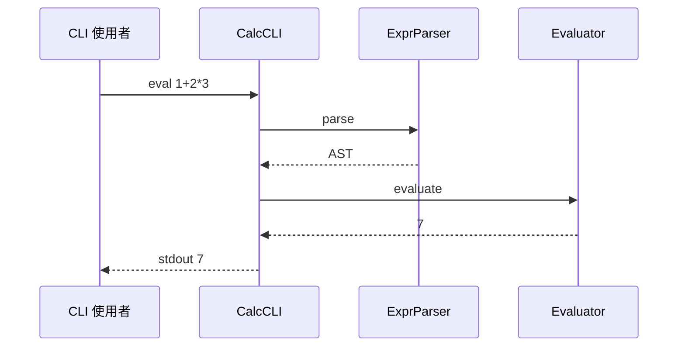
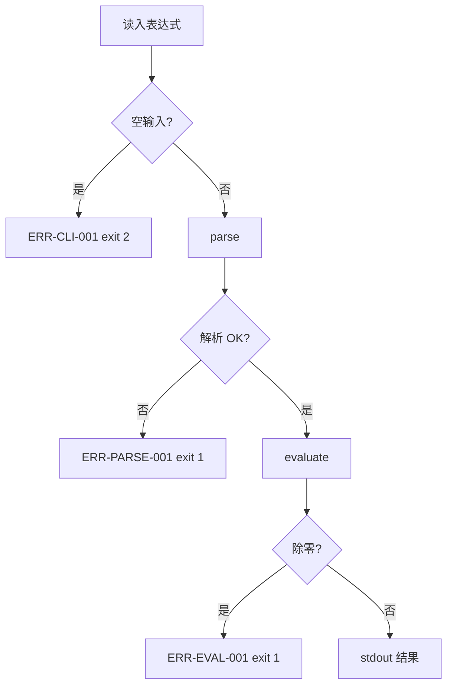
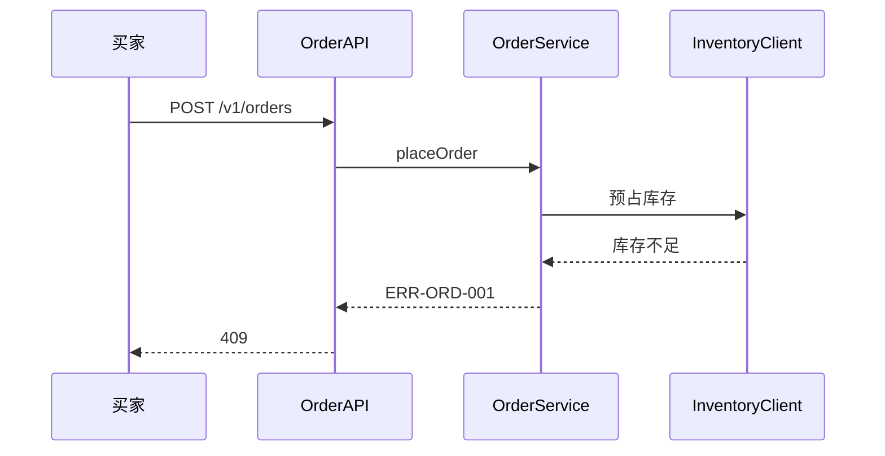
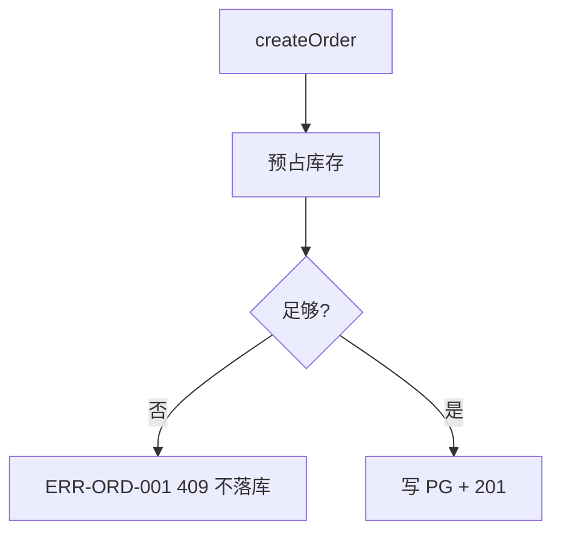
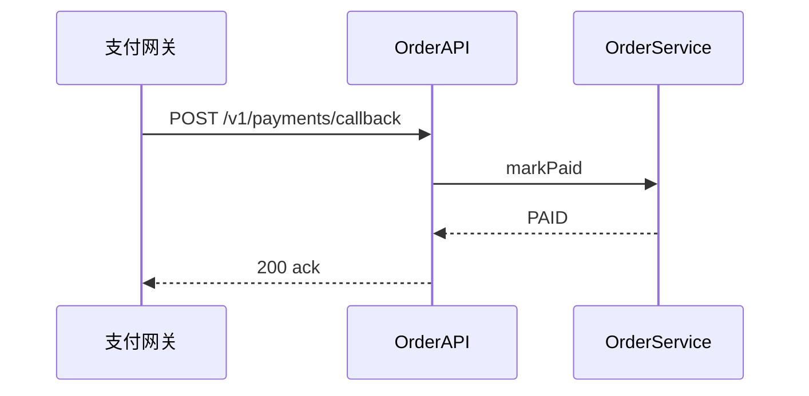

# flow-spec.md — `*.mmd` 格式规范

> **状态：** 定稿 · [artifact-templates 索引](./README.md)  
> **配套规范：** [prd-spec.md](./prd-spec.md) · [design-spec.md](./design-spec.md) · [review-spec.md](./review-spec.md)  
> **Run 路径：** `docs/runs/<task_id>/*.mmd`（常见 `flow.mmd`、`flow-*.mmd`、`architecture-*.mmd`）  
> **登记：** `design.json` → `diagrams[]`（[`artifact-schemas/design-spec.md`](../artifact-schemas/design-spec.md) · `DiagramRef`）  
> **校验：** `DES-203`、`DES-214`（[quality-gates.md §4.2](../quality-gates.md#42-designmd--flowmmd-格式p1)）  
> **对应：** [design-spec.md](./design-spec.md) **§4.1 概述**（全局架构）· **§4.6 流程与时序**

---

## 文档定位

| 对比 | Run `design.md` | Run `*.mmd`（本规范） |
|------|-----------------|------------------------|
| 格式 | Markdown 章节 | **纯 Mermaid**（无围栏） |
| 内容 | 文字 + 表 + **引用** 图文件 | 时序 / 流程 / 架构拓扑 |
| 索引 | §4.6 正文 + 附录 | `design.json` → `diagrams[]` |

**下游：** Developer / QA / validate **读 `design.json` 的 `diagrams[]` 与 Run 目录下的 `.mmd` 文件**；HITL 对照 `design.md` §4.6 与同名 `.mmd`。

**不含：** ~~部署 / Rollout 图~~ — Design Doc 已移除 Rollout；Architect **不在 Run 产出** `deploy.mmd`。`DiagramKind.deployment` 仅 schema 保留，**Run 不登记**。

---

## 语言与格式

| 项 | 约定 |
|----|------|
| **节点说明** | 宜 **中文**（如「解析失败」「库存不足」） |
| **participant / 节点名** | 与 §4.2 `modules[].name` 或 `code_domain` 标签一致（`DES-204`） |
| **错误码** | 异常节点标注 `ERR-{域}-{序号}`，与 design §6.2 一致 |
| **文件内容** | **仅 Mermaid** — 不要 markdown 围栏（`` ```mermaid ``） |

---

## 硬性要求（design-spec §4.6）

| 要求 | 规则 | Mermaid |
|------|------|---------|
| **时序图** | **必填** ≥1 | `sequenceDiagram` |
| **流程图** | **必填** ≥1 | `flowchart`（含 **异常 / 重试** 分支） |
| **登记** | `diagrams[]` 同时含 `kind: sequence` 与 `kind: flowchart` | 可 **同文件多段** 或 **多文件** |
| **解析** | `DES-203` | `validation.design.validate_mermaid: true` 时须可解析 |
| **命名** | `DES-204` | participant / 节点 ≡ `modules[]` / `interfaces[]` |
| **异常** | 流程图 **须** ≥1 条异常路径 | 节点标注 `ERR-*`，对齐 §6.2 `error_catalog` |

### 与用户故事（US）

每个 P0 **`US-*`**（spec `user_stories[]`）须 **可追溯** 到：

- **至少 1 张** `kind: sequence` 的时序图  
- **至少 1 张** `kind: flowchart` 的流程图  

复杂场景 **可多张**（多 `.mmd` 或同文件多段）；`diagrams[].title` 或 design §4.6 表 **注明 `US-*`**（见 [design-spec 订单样例 §4.6](./design-spec.md#样例文档--default-profile电商平台订单系统--完整)）。

### 全局架构图（design-spec §4.1）

| 条件 | 要求 |
|------|------|
| §4.2 模块 ≥2 **或** §4.3 有外部依赖 | **推荐必填** `kind: context` |
| 文件名 | `architecture-*.mmd`（如 `architecture-order.mmd`） |
| Mermaid | `flowchart` — 本系统边界内模块 + 外部依赖静态拓扑 |
| 分工 | **context** = 「谁连谁」；**sequence / flowchart** = 「一次请求怎么走」 |

---

## 文件约定

| 项 | 约定 |
|----|------|
| 扩展名 | `.mmd` |
| **极简任务** | 单文件 `flow-calc.mmd` 或 `flow.mmd` — sequence + flowchart **同文件** |
| **多 US / 多服务** | 按 US 拆分：`flow-order-us1.mmd` …；回调等可独立 `flow-order-us2-callback.mmd` |
| **全局架构** | `architecture-*.mmd` — 登记 `kind: context` |
| **不推荐** | ~~`context.mmd`~~（改用 `architecture-*.mmd`）、~~`deploy.mmd`~~（Rollout 已移出 Design Doc） |

同目录可有 **多个** `.mmd`；`diagrams[].path` 须与 Run 落盘路径 **完全一致**。

---

## 图类型索引

| `kind` | Mermaid | design-spec.md | Run 必填 |
|--------|---------|----------------|----------|
| `sequence` | `sequenceDiagram` | §4.6 | ✓（全局 ≥1） |
| `flowchart` | `flowchart` | §4.6 | ✓（全局 ≥1） |
| `context` | `flowchart` | §4.1 | 模块 ≥2 或 §4.3 有依赖时 **推荐** |
| `class` | `classDiagram` | §4.4 / §4.5 | P1 |
| ~~`deployment`~~ | — | — | **不产出**（schema 保留；Rollout 不在 Design Doc） |

---

## 同文件多段（DES-214）

同一 `.mmd` 可连续写多段 Mermaid（段间空行分隔）。`diagrams[]` **同一 `path` 可登记多条**（不同 `kind` / `title`）：

```text
sequenceDiagram
    ...

flowchart TD
    ...
```

门禁 `DES-214` 要求该文件内 **可识别** sequence 与 flowchart 两类图。

---

## 模板 — Calculator（极简 · 单文件）

**`architecture-calc.mmd`**（`kind: context`）


**`flow-calc.mmd`** — 时序 + 流程（同文件多段；`diagrams[]` 登记两条）





---

## 模板 — 订单系统（多 US · 多文件）

**`architecture-order.mmd`** — 见 [design-spec §4.1 样例](./design-spec.md#样例文档--default-profile电商平台订单系统--完整)。

**`flow-order-us4.mmd`** — 单 US 时序 + 流程（库存不足）





**`flow-order-us2-callback.mmd`** — 可选第 2 张时序（支付回调 · 仅 `sequence`）



---

## diagrams[] 登记示例

**极简（Calculator · 单文件）：**

```json
[
  { "path": "architecture-calc.mmd", "kind": "context", "title": "计算器模块拓扑" },
  { "path": "flow-calc.mmd", "kind": "sequence", "title": "US-1 求值时序" },
  { "path": "flow-calc.mmd", "kind": "flowchart", "title": "US-4 异常分支" }
]
```

**完整（订单 · 多文件 · 摘要）：**

```json
[
  { "path": "architecture-order.mmd", "kind": "context", "title": "订单系统全局架构" },
  { "path": "flow-order-us1.mmd", "kind": "sequence", "title": "US-1 创建订单" },
  { "path": "flow-order-us1.mmd", "kind": "flowchart", "title": "US-1 创建订单（含幂等）" },
  { "path": "flow-order-us2.mmd", "kind": "sequence", "title": "US-2 支付订单" },
  { "path": "flow-order-us2-callback.mmd", "kind": "sequence", "title": "US-2 支付回调 markPaid" },
  { "path": "flow-order-us4.mmd", "kind": "sequence", "title": "US-4 库存不足" },
  { "path": "flow-order-us4.mmd", "kind": "flowchart", "title": "US-4 库存不足分支" }
]
```

完整列表见 [design-spec 订单样例 `diagrams[]`](./design-spec.md#样例文档--default-profile电商平台订单系统--完整)。

---

## 实现与校验

| 组件 | 说明 |
|------|------|
| `design_validate` | `multi_agent_code_factory/nodes/design_validate.py` — MVP：`flow.mmd` **存在且非空**（`DES-017` warn） |
| `validate_mermaid` | Profile `validation.design.validate_mermaid`（默认 **false**）；为 `true` 时启用 `DES-203` 解析 |
| `mermaid.py` | **P1 计划** — 完整 Mermaid 解析与 `DES-204` participant 校验 |
| Architect | **必须** 产出 sequence + flowchart；异常分支对齐 `error_catalog`；`diagrams[]` 与 Run 文件一致 |

Architect 写图时 **须** 与 [design-spec.md](./design-spec.md) §4.2 模块名、§6.2 错误码保持一致。
