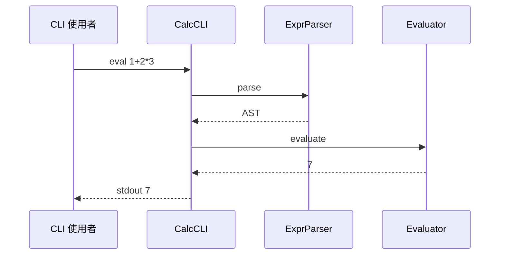
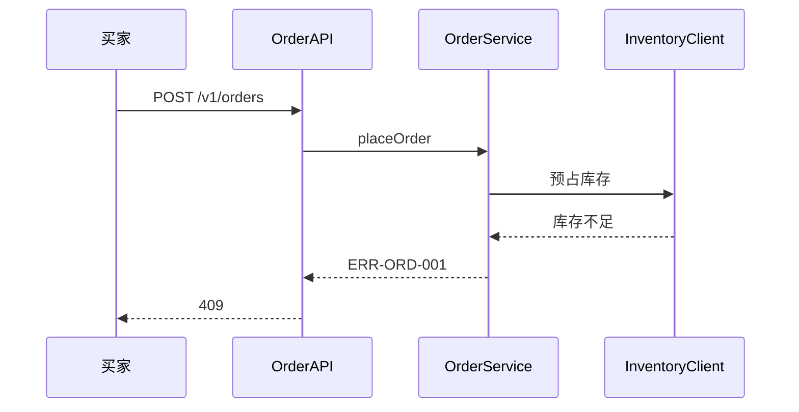
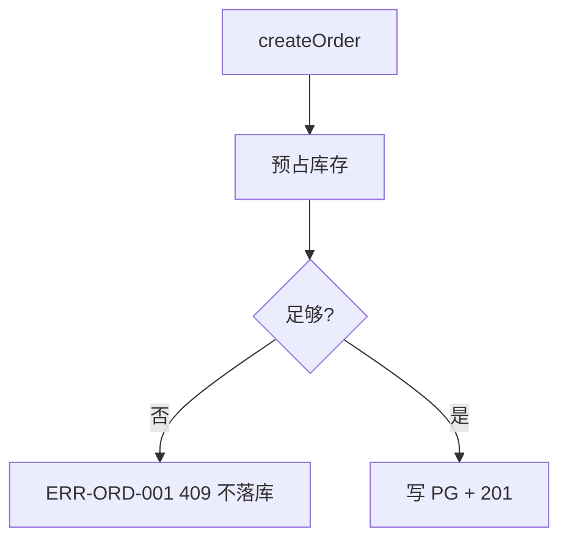
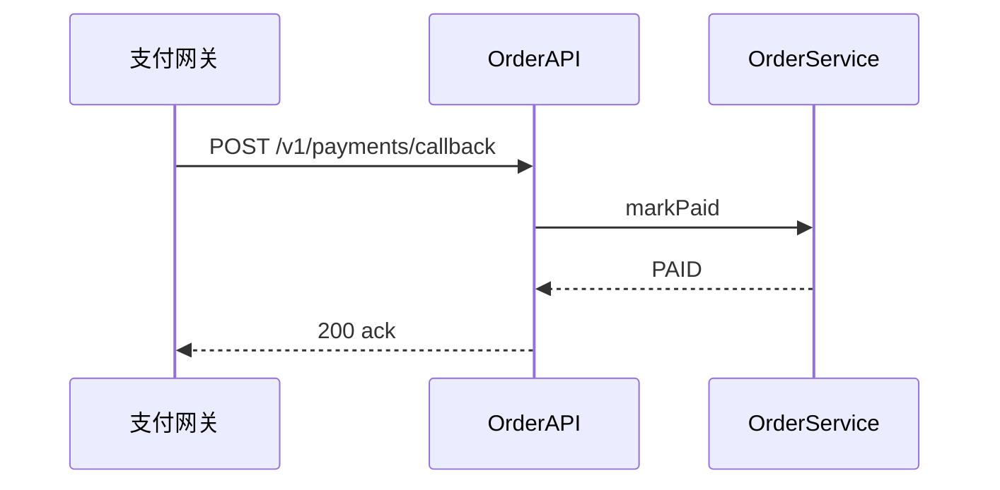

# flow-spec.md — `*.mmd` 格式规范

> **状态：** 定稿 · [artifact-templates 索引](./README.md)  
> **配套规范：** [prd-spec.md](./prd-spec.md) · [design-spec.md](./design-spec.md) · [review-spec.md](./review-spec.md)  
> **Run 路径：** `docs/runs/<task_id>/*.mmd`（常见 `flow.mmd`、`flow-*.mmd`、`architecture-*.mmd`）  
> **登记：** `design.json` → `diagrams[]`（[`artifact-schemas/design-spec.md`](../artifact-schemas/design-spec.md) · `DiagramRef`）  
> **校验：** `DES-203`、`DES-214`（[design-validate.md §4.2](../quality-gates/design-validate.md#42-designmd--mmd-格式-p1)）  
> **对应：** [design-spec.md](./design-spec.md) **§4.2 系统架构图**（静态拓扑）· **§4.7 流程与时序**（动态路径）

---

## 文档定位

| 对比 | Run `design.md` | Run `*.mmd`（本规范） |
|------|-----------------|------------------------|
| 格式 | Markdown 章节 | **纯 Mermaid**（无围栏） |
| 内容 | 文字 + 表 + **引用** 图文件 | 时序 / 流程 / 架构拓扑 |
| 索引 | §4.2 / §4.7 正文 + 附录 | `design.json` → `diagrams[]` |

**下游：** Developer / QA / validate **读 `design.json` 的 `diagrams[]` 与 Run 目录下的 `.mmd` 文件**；HITL 对照 `design.md` §4.2 / §4.7 与同名 `.mmd`。

**不含：** ~~部署 / Rollout 图~~ — Design Doc 已移除 Rollout；Architect **不在 Run 产出** `deploy.mmd`。`DiagramKind.deployment` 仅 schema 保留，**Run 不登记**。

---

## 语言与格式

| 项 | 约定 |
|----|------|
| **节点说明** | 宜 **中文**（如「解析失败」「库存不足」） |
| **participant / 节点名** | 与 §4.3 模块名 / 域前缀标签一致（`DES-204`） |
| **错误码** | 异常节点标注 `ERR-{域}-{序号}`，与 design §4.5 / §6 一致 |
| **文件内容** | **仅 Mermaid** — 不要 markdown 围栏（`` ```mermaid ``） |

---

## 何时需要产出图（与 design-spec 对齐）

| design.md 情况 | Run `.mmd` 要求 |
|----------------|-----------------|
| **§4.7 整节省略**（如计算器级小任务） | §4.2 架构图 **可选**；**不强制** sequence/flowchart；若产出图仍须登记 `diagrams[]` |
| **写了 §4.7** | §4.7 **US → 图表对照表** 中引用的每个 `.mmd` **须存在**；每个 **主要 US**（P0 FEAT 关联）**至少 1 张图**（时序 **或** 流程均可） |
| **§4.2 写了架构图** | 对应 `architecture-*.mmd` 须存在，登记 `kind: context` |

### 写了 §4.7 时的图类型（design-spec §4.7）

| 要求 | 规则 | Mermaid |
|------|------|---------|
| **主要 US 配图** | 每个主要 `US-*` **≥1** 张可追溯图（时序 **或** 流程，或同文件多段） | `sequenceDiagram` / `flowchart` |
| **Run 级建议** | 全 run **宜** 同时含 **≥1** 时序与 **≥1** 流程（可分布在不同 US、不同文件） | 异常/分支 **宜** 用 flowchart 表达 |
| **登记** | `diagrams[]` 每条须 `path` + `kind` + `title`（title 宜含 `US-*`） | 同文件多段可登记多条、同 `path` |
| **解析** | `DES-203` | `validation.design.validate_mermaid: true` 时须可解析 |
| **命名** | `DES-204` | participant / 节点 ≡ §4.3 模块（或微服务）名 |
| **异常** | 流程图 **宜** 含 ≥1 条异常路径 | 节点标注 `ERR-*`，对齐 §6 NEG 用例 |

**同文件多段：** 一个 `.mmd` 内连续多段 Mermaid（空行分隔）计为 **多张图**；§4.7 对照表「图类型」列可写 `时序 + 流程` 表示同文件多段，**仍满足**「该 US 至少 1 张图」。

**未写 §4.7：** **不要求** 每个 P0 US 单独配图；若 Profile 仍产出 `flow-*.mmd`（如 CI 模板），按实际 §4.2 / §6 追溯即可。

### 全局架构图（design-spec §4.2）

| 条件 | 要求 |
|------|------|
| 写了 `### 4.2 系统架构图` | 须有对应 `architecture-*.mmd` |
| 模块 ≥2 **或** §4.4 有外部依赖 | **任务级推荐** 写 §4.2 + `architecture-*.mmd` |
| 文件名 | `architecture-*.mmd`（如 `architecture-order.mmd`） |
| Mermaid | `flowchart` — 本系统边界内模块 + 外部依赖静态拓扑 |
| 分工 | **context** = 「谁连谁」；**sequence / flowchart** = 「一次请求怎么走」（§4.7） |

---

## 文件约定

| 项 | 约定 |
|----|------|
| 扩展名 | `.mmd` |
| **极简任务（无 §4.7）** | 可选 `flow-calc.mmd` 或 `flow.mmd` |
| **写了 §4.7** | 按 US 拆分：`flow-order-us1.mmd` …；回调等可独立 `flow-order-us2-callback.mmd` |
| **全局架构** | `architecture-*.mmd` — 登记 `kind: context` |
| **不推荐** | ~~`context.mmd`~~（改用 `architecture-*.mmd`）、~~`deploy.mmd`~~（Rollout 已移出 Design Doc） |

同目录可有 **多个** `.mmd`；`diagrams[].path` 须与 Run 落盘路径 **完全一致**。

---

## 图类型索引

| `kind` | Mermaid | design-spec.md | Run 必填 |
|--------|---------|----------------|----------|
| `sequence` | `sequenceDiagram` | §4.7 | 写了 §4.7 时 **宜** ≥1（全 run） |
| `flowchart` | `flowchart` | §4.7 | 写了 §4.7 时 **宜** ≥1（全 run）；含异常分支 |
| `context` | `flowchart` | §4.2 | 写了 §4.2 时 **须** 有对应文件 |
| `class` | `classDiagram` | §4.5 / §4.6（可选） | P1 |
| ~~`deployment`~~ | — | — | **不产出**（schema 保留；Rollout 不在 Design Doc） |

---

## 同文件多段（DES-214）

同一 `.mmd` 可连续写多段 Mermaid（段间空行分隔）。`diagrams[]` **同一 `path` 可登记多条**（不同 `kind` / `title`）：

```text
sequenceDiagram
    ...

flowchart TD
    ...
```

门禁 `DES-214` 要求该文件内 **可识别** sequence 与 flowchart 两类图（**仅当** Profile 启用且该文件声称含两类图时）。

---

## 模板 — Calculator（极简 · 无 §4.7）

计算器级 design **可省略 §4.7**；下列图为 **可选参考**（Profile 若要求出图时使用）。

**`architecture-calc.mmd`**（`kind: context` · 可选）


**`flow-calc.mmd`** — 时序 + 流程（同文件多段；`diagrams[]` 登记两条 · 可选）

```mermaid
flowchart TD
    A[读入表达式] --> B{空输入?}
    B -->|是| E0[ERR-CLI-001 exit 2]
    B -->|否| C[parse]
    C --> D{解析 OK?}
    D -->|否| E1[ERR-PARSE-001 exit 1]
    D -->|是| F[evaluate]
    F --> G{除零?}
    G -->|是| E2[ERR-EVAL-001 exit 1]
    G -->|否| H[stdout 结果]
```





---

## 模板 — 订单系统（写了 §4.7 · 多 US · 多文件）

**`architecture-order.mmd`** — 见 [design-spec · §4.2 补充片段](./design-spec.md#补充片段)。

**`flow-order-us4.mmd`** — 单 US 时序 + 流程（库存不足；同文件多段 = 该 US 至少 1 张图）





**`flow-order-us2-callback.mmd`** — 可选第 2 张时序（支付回调 · 仅 `sequence`）



---

## diagrams[] 登记示例

**极简（Calculator · 无 §4.7 · 可选出图）：**

```json
[
  { "path": "architecture-calc.mmd", "kind": "context", "title": "计算器模块拓扑" },
  { "path": "flow-calc.mmd", "kind": "sequence", "title": "US-1 求值时序" },
  { "path": "flow-calc.mmd", "kind": "flowchart", "title": "US-4 异常分支" }
]
```

**订单（写了 §4.7 · 多文件 · 摘要）：**

```json
[
  { "path": "architecture-order.mmd", "kind": "context", "title": "订单系统全局架构" },
  { "path": "flow-order-us1.mmd", "kind": "sequence", "title": "US-1 创建订单" },
  { "path": "flow-order-us1.mmd", "kind": "flowchart", "title": "US-1 创建订单（含幂等）" },
  { "path": "flow-order-us2.mmd", "kind": "sequence", "title": "US-2 支付订单" },
  { "path": "flow-order-us2-callback.mmd", "kind": "sequence", "title": "US-2 支付回调 markPaid" },
  { "path": "flow-order-us4.mmd", "kind": "sequence", "title": "US-4 库存不足" },
  { "path": "flow-order-us4.mmd", "kind": "flowchart", "title": "US-4 库存不足分支" }
]
```

完整片段见 [design-spec · 完整示例 · 补充片段](./design-spec.md#补充片段)。

---

## 实现与校验

| 组件 | 说明 |
|------|------|
| `design_validate` | `multi_agent_code_factory/nodes/design_validate.py` — MVP：`flow.mmd` **存在且非空**（`DES-017` warn） |
| `validate_mermaid` | Profile `validation.design.validate_mermaid`（默认 **false**）；为 `true` 时启用 `DES-203` 解析 |
| `mermaid.py` | **P1 计划** — 完整 Mermaid 解析与 `DES-204` participant 校验 |
| Architect | 图与 [design-spec.md](./design-spec.md) §4.3 模块名、§4.5 / §6 错误码一致；`diagrams[]` 与 Run 文件一致 |
