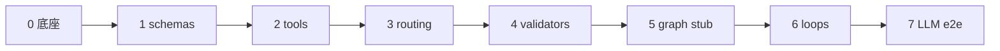

# V1 实现计划

## 依赖上游文档（只读）

编制 / 修订实现计划时 **以本表及正文阶段任务为准**；契约、模板与门禁以细目文档为准。**[P1-backlog.md](./P1-backlog.md)** 为下游跟踪清单，不在此表列出。


| 分类      | 上游文档                                                                 | 定位                 |
| ------- | -------------------------------------------------------------------- | ------------------ |
| **总设计**  | [multi-agent-pipeline-design.md](./multi-agent-pipeline-design.md) | 系统的总体设计书 |
| **细目索引** | [README.md](./README.md)                                             | pipeline 细目索引 |
| **领域（V2）** | [domains/README.md](../../../domains/README.md)                       | 本计划不含 V2 领域包       |


---

> **依据：** [multi-agent-pipeline-design.md](./multi-agent-pipeline-design.md)（§1.2 MVP、§6.2 目录、§10 验收）  
> **状态：** 设计已定稿，待编码  
> **范围：** V1 通用流水线；**不含** V2 领域包（[domains/](../../../domains/README.md)）、checkpoint/resume、强制 HITL interrupt

---

## 1. 当前代码现状

| 已有 | 缺失 |
|------|------|
| `pyproject.toml`（Pydantic、PyYAML、Ruff、mypy、pytest） | LangGraph / LLM 客户端依赖 |
| `config/autonomy_policy.yaml`（全局 `loop_limits`） | `config.py` 加载器 |
| `multi_agent_code_factory/__init__.py` | `graph.py`、`state.py`、`graph_routing.py` |
| `multi_agent_code_factory/profiles/*.yaml` | `profiles.py` 加载逻辑 |
| `tests/test_version.py` | `schemas/`、`agents/`、`nodes/`、`validators/`、`tools/` |

**结论：** 设计 Spec 已齐，引擎层几乎为空；实现应按依赖 **自下而上**，先 **竖切一条 Happy Path**（`default` + Todo CLI），再补回路、校验与多 Profile。

---

## 2. 实现原则

1. **自下而上：** 先能解析配置与产物，再拼图，最后接 LLM。
2. **竖切 Happy Path：** `default` Profile + Todo CLI 端到端跑通后，再扩展回路与多语言。
3. **以 §10 为验收清单：** 每阶段对照主线 [§10](./multi-agent-pipeline-design.md#10-验收) 中标 **[MVP]** 的项。
4. **路由以实现为准：** `graph_routing.py` 与 [§4.3](./multi-agent-pipeline-design.md#43-循环路由hitl-与-deploy) 伪代码保持一致；用单测锁定行为。
5. **V1 边界：** 见主线 [§1.2 MVP 范围](./multi-agent-pipeline-design.md#12-mvp-范围v1-实现边界)；P1/P2 项不阻塞首条 demo。
6. **规则以白名单为准：** 见 [§3.1 MVP 规则白名单](#31-mvp-规则白名单)；不得默认实现 quality-gates 全表 error 规则。

**相关 backlog：**

- [metagpt.md §B.3](./references/metagpt.md#b3-实现-backlog设计已定待编码)
- [open-source-survey.md §C.5](./references/open-source-survey.md#c5-实现-backlog)

---

## 3. 阶段总览



| 阶段 | 目标 | 预估（单人） |
|------|------|--------------|
| 0 工程底座 | 可安装、CLI 骨架、`config` + `profiles`、CI | 1–2 天 |
| 1 Schema 层 | 8 类 Artifact Pydantic 校验 | 2–4 天 |
| 2 Run 落盘与 Tool | `docs/runs/` 读写、`run_tests` + `junit_xml` | 2–3 天 |
| 3 路由与状态 | `graph_routing.py` + `state.py` 单测 | 2–3 天 |
| 4 Validate 节点 | [§3.1](#31-mvp-规则白名单) 白名单 + validate 节点 | 3–5 天 |
| 5 LangGraph 主干 | 全图边 + Stub Agent + HITL 占位 | 3–5 天 |
| 6 回路与上限 | `loop_limits`、升环再入、作废 stale 产物 | 3–4 天 |
| 7 端到端 | 真实 LLM + `default` Todo CLI | 3–5 天 |

**合计：** 首条 Stub demo 约 **1–2 周**；完整 MVP（含 LLM e2e 与回路）约 **4–6 周**（含测试）。主要风险在阶段 4（规则）与阶段 7（LLM + 写码 + pytest 绿）。

### 3.1 MVP 规则白名单

与主线「MVP 仅 Pydantic + **核心** error 规则」对齐；**未列入下表的 rule_id 一律 P1**，实现中不得默认启用。

#### spec（`validators/prd_rules.py`）

| 纳入 MVP | rule_id | 说明 |
|----------|---------|------|
| 是 | `PRD-001`–`016` | [spec-validate §3.1](./quality-gates/prd-validate.md#31-结构与必填error) 结构与必填 |
| 否 | `PRD-101`–`114`、`PRD-201`–`202` | §3.2 可测性（多为 warn；P1） |
| 否 | `PRD-301`–`308` | §3.3 `prd.md` 格式（P1） |

#### design（`validators/design_rules.py`）

| 纳入 MVP | rule_id | 说明 |
|----------|---------|------|
| 是 | `DES-001`–`007` | 结构：dev_tasks、file_plan、依赖无环、modules 等 |
| 是 | `DES-008`–`010` | `context_view`、`solution_strategy`、`non_goals`、`traceability`、`cross_cutting` |
| 是 | `DES-101`–`104` | AC 追溯、scope_out、路径逃逸 |
| 条件 | `DES-011` | 仅当 spec §8 **非 trivial** 时要求 `non_functional` 非空 |
| 否 | `DES-012`–`033` | 域模型、错误码、接口细规、test_cases 等（P1；Todo fixture 可暂不触发） |
| 否 | `DES-201`–`221` | design.md / flow.mmd 格式（P1） |
| 是 | `DES-301` | `hitl_flags` 命中 → 标记 `require_hitl`（路由用；`default` 通常不触发） |

#### Mermaid（MVP 策略）

| 项 | MVP 做法 |
|----|----------|
| `validation.design.validate_mermaid` | **`default` Profile 设为 `false`**（阶段 4 改 YAML）；避免未实现 `mermaid.py` 时触发 `DES-203` |
| `flow.mmd` | Architect **写出文件**；validate 仅可选检查 **存在且非空**（不算 P1 语法解析） |
| P1 | `validators/mermaid.py` + `DES-203` 等完整 Mermaid 校验 |

#### Golden fixture

- [`examples/snippets/prd-default.json`](./examples/snippets/prd-default.json) 已含 `context.language`，与 `default` Profile 的 `language: python` 对齐（`PRD-006`）。
- 新增或修改 fixture 时须同步通过 MVP 白名单单测。

### 3.2 Profile 矩阵 vs Parser（验收分层）

主线 §1.2 **纳入** 多语言 Profile YAML，但 **不纳入** `go_json` / `cargo_json` / `forge_json`（P1）。实现计划区分两层验收：

| 层级 | 范围 | 验收方式 |
|------|------|----------|
| **A. 配置加载** | 全部 V1 Profile（`default`、`go-cli`、`java-maven`、`java-gradle`、`rust-cli`、`solidity-foundry`） | `profiles.py` 单测：`code_root` 解析、`toolchain` 归一化、仓库内路径拒绝 |
| **B. QA 跑通** | `default`；可选 `java-maven`（同为 `junit_xml`） | 集成测试 / 手工 e2e |
| **C. 多语言 e2e** | `go-cli`、`rust-cli`、`solidity-foundry` 等 | **P1**（依赖对应 Parser）；MVP 不要求 |

§10「换 `--profile` 可跑不同 `code_root` 与 toolchain」**[MVP]** 指 **层级 A**；层级 B 为 MVP 主路径；层级 C 不阻塞 V1 发布。

### 3.3 人读产物分工（MVP）

| 文件 | MVP 产出方式 |
|------|----------------|
| `prd.md` | `renderers/prd_md.py`（P0；可先极简） |
| `design.md` | **Architect Agent 直接写出**（`renderers/design_md.py` 为 P1） |
| `flow.mmd` | **Architect Agent 直接写出**（见 [examples/snippets/flow-todo.mmd](./examples/snippets/flow-todo.mmd)） |
| `review.md` | Reviewer Agent 写出或 P1 renderer；MVP 可仅 `review.json` |

---

## 4. 阶段 0：工程底座

**目标：** `pip install -e ".[dev]"` 通过；测试与类型检查可跑。

| 任务 | 产出 |
|------|------|
| 补 `pyproject.toml` 运行时依赖 | `langgraph`、`langchain-core`、LLM 客户端（与 [§9 环境变量](./multi-agent-pipeline-design.md#9-环境变量) 一致） |
| `config.py` | **加载已有** [`config/autonomy_policy.yaml`](../../../config/autonomy_policy.yaml) + `FACTORY_*` → `LoopLimits` |
| `profiles.py` | 加载 `profiles/*.yaml`；校验 `code_root` 不在本仓库内；`test_command` 归一化到 `toolchain`（见 [profiles.md](./profiles.md)） |
| `__main__.py` | 最小 CLI：`run --profile --task-id "需求"`（可先只解析参数） |
| `checkpoint.py` | **占位**（`raise NotImplementedError` 或空模块）；resume 为 P1 |
| CI | GitHub Actions：`ruff` / `mypy` / `pytest`（与 PR 门禁一致） |

**测试：** `tests/test_profiles.py`、`tests/test_config.py`（临时目录测 `code_root` 解析；**层级 A** 覆盖矩阵内各 Profile）。

**代码落点：** 见 [§6.2](./multi-agent-pipeline-design.md#62-multi_agent_code_factory-详解) 包根 `config.py`、`profiles.py`、`__main__.py`。

---

## 5. 阶段 1：Schema 层

**目标：** [§5 产物索引](./multi-agent-pipeline-design.md#5-结构化产物索引) 所列 8 类 Run JSON 可序列化/反序列化。

**目录：** `multi_agent_code_factory/schemas/`（与 [artifact-schemas/](./artifact-schemas/README.md) 对齐）

```
schemas/
├── __init__.py          # 统一导出
├── spec.py
├── design.py
├── dev_manifest.py
├── test_report.py
├── review.py
├── hitl.py
├── validation_report.py
└── run_meta.py
```

**做法：**

- 先实现 MVP **必填字段**；复杂嵌套可分期补充。
- 以 [examples/snippets/](./examples/README.md) 下 JSON 为 **golden fixture**（含已修正的 `prd-default.json`）。
- `reflection` 等字段可先最小实现（主线 §1.2）。
- `run_meta.json` 预留 `budget` 用量字段（若配置则记录；触顶熔断 P1）。

**测试：** 每个 schema 至少 1 个合法样例 + 1 个非法样例单测。

---

## 6. 阶段 2：Run 落盘与 Tool 底座

**目标：** 能读写 `docs/runs/<task_id>/`；QA 能产出 `TestReport`。

| 模块 | 职责 |
|------|------|
| `tools/write_artifact.py` | 写 JSON、更新 `run_meta.json`（含 `profile` 快照、`loop_limits`） |
| `tools/read_file.py` / `write_file.py` | 相对 `code_root` 读写 |
| `tools/run_tests.py` | 执行 `Profile.toolchain` → 调 Parser |
| `tools/linter.py` | 执行 `toolchain.lint_command`（`default` 为 Ruff） |
| `tools/test_parsers/junit_xml.py` | MVP **唯一必需** Parser |
| `tools/test_parsers/exit_code_only.py` | 兜底（未实现 Parser 的 Profile 加载测试用） |
| `tools/registry.py` | 按 Profile.`tools` 挂载（SWE-agent 式 **少量专用 Tool**） |
| `renderers/prd_md.py` | `prd.json` → `prd.md`（P0；可先极简） |

**测试：**

- 在临时目录建假 `code_root`，跑 `pytest` 并解析 JUnit XML（可用本仓库 `tests/` 作靶项目）。
- **不依赖 LLM。**

**验收对照：** §10「`run_tests` + `junit_xml` Parser」**[MVP]**。

---

## 7. 阶段 3：路由与状态

**目标：** [§4.3](./multi-agent-pipeline-design.md#43-循环路由hitl-与-deploy) 四条路由函数行为与设计一致。

| 文件 | 内容 |
|------|------|
| `state.py` | [§7 图状态](./multi-agent-pipeline-design.md#7-图状态)（`TypedDict` 或 Pydantic State） |
| `graph_routing.py` | `route_after_test`、`route_after_review`、`route_after_prd_validate`、`route_after_design_validate` |

**单测场景（纯函数，无 LLM）：**

| 函数 | 覆盖 |
|------|------|
| `route_after_test` | pass / fail / 触顶 |
| `route_after_review` | `developer` / `architect` / `pm` / `deploy`+`approved` / `deploy`+`not approved` |
| `route_after_prd_validate` | violations → PM；`require_hitl` 分支 |
| `route_after_design_validate` | violations → Architect；`require_hitl` 分支 |

**验收对照：** §10「实现环、设计环、需求环路由」「`route_after_review`：`approved=false` 时不进 `deploy_hitl`」**[MVP]**。

---

## 8. 阶段 4：Validate 节点

**目标：** `prd_validate` / `design_validate` 跑通 **[§3.1 MVP 规则白名单](#31-mvp-规则白名单)**。

| 模块 | MVP 范围 |
|------|----------|
| `validators/prd_rules.py` | 白名单 `PRD-001`–`016` |
| `validators/design_rules.py` | 白名单 `DES-001`–`010`、`DES-101`–`104`、条件 `DES-011`、`DES-301` |
| `nodes/prd_validate.py` | 调 validator → 写 `prd_validation.json` |
| `nodes/design_validate.py` | 同上 → `design_validation.json`；`validate_mermaid: false` 时跳过 Mermaid 解析 |

**配置变更（本阶段一并提交）：**

- [`profiles/default.yaml`](../../../multi_agent_code_factory/profiles/default.yaml)：`validation.design.validate_mermaid: false`（MVP；见 [§3.1](#31-mvp-规则白名单)）

**暂不实现（P1）：** `PRD-101+`、`DES-012`–`033`、`spec_md_rules`、`mermaid.py` 语法校验。

**测试：** 用 `examples/snippets/prd-default.json` + 故意缺字段 fixture 测 violations 与再入路由。

**验收对照：** §10「`prd_validate` / `design_validate` MVP 规则跑通」**[MVP]**。

---

## 9. 阶段 5：LangGraph 主干

**目标：** **注册全线节点与条件边**；Stub 只走 happy path，但图结构与 §1 一致。

**主线：**

```text
PM → prd_validate → [prd_hitl?] → Architect → design_validate → [design_hitl?]
  → Developer → QA → Reviewer → [deploy_hitl?] → Deploy
```

| 模块 | 说明 |
|------|------|
| `graph.py` | `StateGraph`：**全部** agents/、nodes/、条件边（含回边占位，阶段 6 用 Stub 触发） |
| `agents/base.py` | Structured Output、`watch` 注入、**`prompts_dir` 加载** |
| `agents/pm.py` … `reviewer.py` | 五 Agent；各 prompt 显式列出默认 `watch`（主线 §4.5） |
| `context.py` | [§4.5](./multi-agent-pipeline-design.md#45-节点上下文watch) 默认 `watch` 表 + [RetryBundle](./multi-agent-pipeline-design.md#451-developer-重试三件套) |
| `nodes/prd_hitl.py` | 占位：`require_hitl=false` → 直通 Architect |
| `nodes/design_hitl.py` | 占位：`require_hitl=false` 且无 `DES-301` → 直通 Developer |
| `nodes/deploy_hitl.py` | 占位：无敏感 `hitl.flags` / glob 命中 → 直通 Deploy |
| `nodes/deploy.py` | 图末 Deploy；写 `run_meta.deploy_status`（默认 `skipped`） |

**MVP 策略：**

1. **第一版：** Agent 输出固定 fixture（或读 `examples/snippets/`），验证图、落盘与人读产物（§3.3）。
2. **第二版：** 接真实 LLM（`DEEPSEEK_API_KEY` 等），仍用 `default` Todo。

**与阶段 6 的边界：** PR-6 应 **已挂好所有条件边**；PR-7 只换 Stub/数据测 fail 与升环，**不重构图**。

**HITL：** 节点 **必须存在**（主线 §1.2）；MVP 不实现 LangGraph **强制 interrupt**（P1），`default` 下均为 skip 直通。

---

## 10. 阶段 6：回路与 loop_limits

**目标：** 测试失败、Reviewer 升环、validate 失败均可回路；触顶时 `on_limit_exceeded=fail`（MVP 默认）。

- 用 Stub 触发各回边与 **再入点**（Developer 修订后回 QA 等）。
- State 维护 `impl_retry_count` / `design_revision_count` / `prd_revision_count`。
- 升环时按 §4.3 作废 `test_report` / `review`（`run_meta.stale_artifacts`，可先最小实现）。

**测试：**

- QA 连续失败至触顶 → `run_meta.status=failed`。
- Reviewer `next_stage=architect` / `pm` 升环与计数。
- validate 失败回 PM/Architect。

**验收对照：** §10「升环再入符合 §4.3（含作废 `test_report` / `review`）」**[MVP]**。

---

## 11. 阶段 7：端到端与 CLI

**目标：** 达到 §10 MVP 主路径（**层级 B**：`default` Todo CLI）。

```bash
python -m multi_agent_code_factory run \
  --profile default \
  --task-id todo-cli \
  "实现命令行 Todo"
```

**§10 [MVP] 核对清单：**

- [ ] 五 Agent + validate / HITL（skip）/ Deploy 图节点全跑通；每步 JSON 通过 Pydantic
- [ ] `prd_validate` / `design_validate`（[§3.1 白名单](#31-mvp-规则白名单)）失败回 PM/Architect
- [ ] `docs/runs/<task_id>/` 下 8 类 JSON + `prd.md` / `design.md` / `flow.mmd`
- [ ] `TestReport.failures` 含 `test_id`、`file`、`line`
- [ ] `run_tests` + `junit_xml`（`default` Profile）
- [ ] 换 `--profile`：`code_root` / `toolchain` 变化（**层级 A** 全矩阵加载；QA 不要求全语言绿）
- [ ] `spec.context.language` 与 Profile.`language` 一致（或 warn）
- [ ] 实现/设计/需求环路由与 `loop_limits` 配置
- [ ] `route_after_review`：`deploy` + `approved=false` 回 Developer
- [ ] `run_meta.json` 含 `loop_limits` 与 `profile` 快照
- [ ] §4.5 `watch` 注入；Developer 重试含 RetryBundle

**集成测试：** `tests/integration/test_todo_cli_e2e.py`（`@pytest.mark.integration`，CI 可选）。

---

## 12. 依赖建议

在 `pyproject.toml` 中补充（版本以实现时锁定为准）：

```toml
dependencies = [
    "pydantic>=2",
    "pyyaml>=6",
    "langgraph>=0.2",
    "langchain-core>=0.3",
    # LLM 客户端与 §9 环境变量一致（init_chat_model + OpenAI 兼容端点）
    "langchain>=1.0,<2",
    "langchain-openai>=1.0,<2",
]
```

LangSmith（`LANGSMITH_*`）可选，用于 Trace 关联 `task_id`（§10 非 MVP）。

---

## 13. PR 拆分建议

| PR | 内容 | 依赖 |
|----|------|------|
| **1** | `config` + `profiles` + CLI 骨架 + CI + 单测（**层级 A** Profile） | — |
| **2** | `schemas/` 全量 + fixture 测试 | PR-1 |
| **3** | `tools/`（含 `linter`）+ `junit_xml` Parser + `spec_md` | PR-2 |
| **4** | `graph_routing.py` + 路由单测 | PR-2 |
| **5** | 白名单 `validators/` + validate 节点 + `default.yaml` `validate_mermaid` | PR-2、PR-4 |
| **6** | `graph.py` 全线边 + HITL 占位 + Stub agents + `context`/`prompts` | PR-3–5 |
| **7** | 回路 + `loop_limits`（Stub 触发） | PR-6 |
| **8** | 真实 LLM + `default` Todo e2e | PR-7 |

每个 PR 应：通过 `ruff` / `mypy` / `pytest`；不扩大 MVP 范围。

---

## 14. V1 明确不做

| 项 | 见 |
|----|-----|
| checkpoint / `resume`（`checkpoint.py` 仅占位） | 主线 §1.2、§4.6（P1） |
| `prd_hitl` / `design_hitl` **强制 interrupt** | 主线 §1.2（P1） |
| `escalation_hitl`（`on_limit_exceeded=escalation_hitl`） | 主线 §1.2（P1） |
| `go_json` / `cargo_json` / `forge_json` Parser 与多语言 **e2e** | profiles.md（P1）；见 [§3.2](#32-profile-矩阵-vs-parser验收分层) |
| Docker `sandbox`、MCP | 主线 §1.2 |
| **V2** `domains/*/profile/`、`arb` | [domains/](../../../domains/README.md) |
| `solidity-hardhat` Profile | profiles.md（P2） |
| quality-gates 白名单外 rule_id | [§3.1](#31-mvp-规则白名单) |

---

## 15. 建议的开工第一步

从 **PR-1 + PR-2 + PR-4（路由 TDD）** 并行起手：

1. `profiles.py` 加载 `default.yaml` 并解析 `../generated/default`；矩阵内其它 Profile **层级 A** 单测
2. `schemas/spec.py` + `schemas/test_report.py` 通过 `examples/snippets/` fixture（含 `context.language`）
3. `graph_routing.py` + 2–3 个路由单测（与 §4.3 对齐）

完成 PR-1 后 CI 固定 Profile 行为；完成 PR-4 后路由与设计双向可追溯；完成 PR-5 后 validate 范围以 [§3.1 白名单](#31-mvp-规则白名单) 为据。

---

## 附录：代码落点速查

完整目录树见主线 [§6.2](./multi-agent-pipeline-design.md#62-multi_agent_code_factory-详解)。实现时 **以实现为准**，本文阶段表与 §6.2 冲突时以 §6.2 与 `graph_routing.py` 为准。

| 设计 Spec | 代码 |
|-----------|------|
| [artifact-schemas/](./artifact-schemas/README.md) | `schemas/` |
| [artifact-templates/](./artifact-templates/README.md) | `renderers/`（MVP：`spec_md`；`design_md` P1） |
| [quality-gates/](./quality-gates/README.md) | `validators/`（**§3.1 白名单**）、`nodes/*_validate.py` |
| [profiles.md](./profiles.md) | `profiles.py` + `profiles/*.yaml` |
| [examples/](./examples/README.md) | 测试 fixture |
