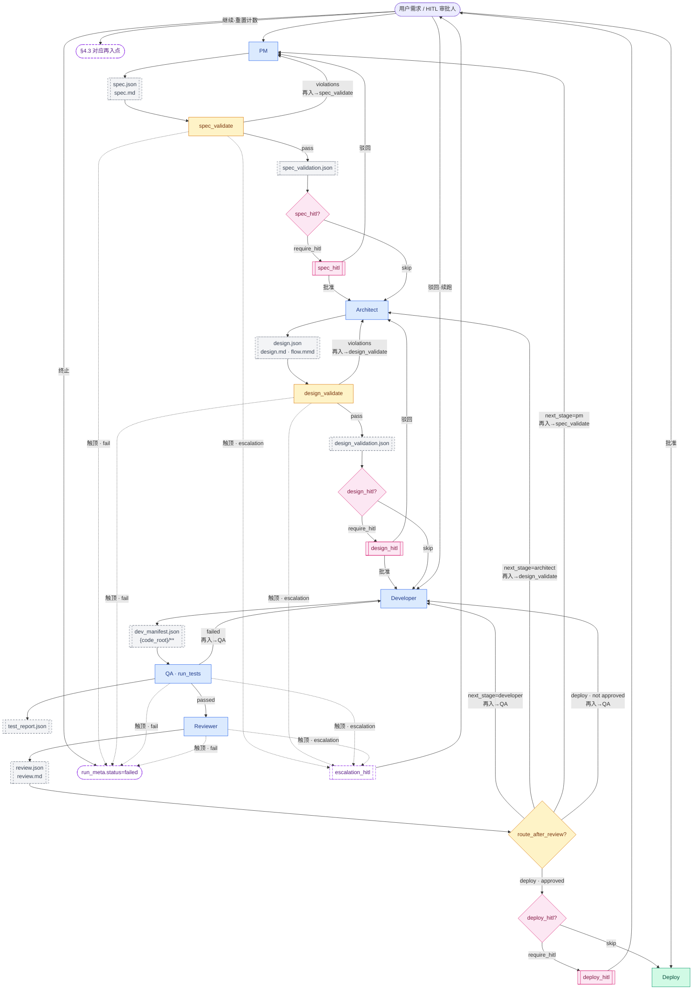

# 多 Agent 研发流水线 — 设计

> **依据：** [00-master-overview.md](../00-master-overview.md)（**V1：通用流水线**，领域差异由 Profile 注入；**与具体业务无关**）  
> **代码目录：** `multi_agent_code_factory/`  
> **状态：** 草案，待评审  
> **交接原则：** 参考 MetaGPT 的 SOP 思路——角色之间用 **结构化产物** 交接，减少自由文本串联导致的幻觉。  
> **细目文档：** [README.md](./README.md)（Profile、Artifact、示例、参考分文件，**本文保持精简**）  
> **外部参考：** [references/](./references/README.md)（MetaGPT、开源调研、术语）

---

## 文档地图

| 文档 | 内容 |
|------|------|
| **本文** | 设计结论、流水线、路由、目录、验收 |
| [profiles.md](./profiles.md) | Profile 字段、Toolchain、Parser、多语言矩阵 |
| [artifact-schemas/](./artifact-schemas/README.md) · [artifact-templates/](./artifact-templates/README.md) | JSON Schema、人读格式、校验规则索引 |
| [`multi_agent_code_factory/profiles/*.yaml`](../../../multi_agent_code_factory/profiles/) | Profile 配置（以 YAML 为准） |
| [`multi_agent_code_factory/schemas/`](../../../multi_agent_code_factory/schemas/) | Pydantic 实现 |
| [quality-gates.md](./quality-gates.md) | PM / Architect **规则校验** + 可选 **人工 HITL** |
| [implementation-plan.md](./implementation-plan.md) | **V1 编码计划**（设计定稿后的实现阶段与 PR 拆分） |
| [examples/](./examples/README.md) | JSON / Mermaid **示例片段** |
| [references/](./references/README.md) | MetaGPT、开源调研、术语 |

---

## 1. 设计结论

| 项 | 决定 |
|----|------|
| **角色** | 五 Agent：见 [§3.1 角色命名约定](#31-角色命名约定)（`pm`/`architect`/`developer`/`qa`/`reviewer` ↔ PM/Architect/Developer/QA/Reviewer） |
| **编排** | LangGraph：**SOP 主线有序**，但含 **条件回路**（实现级 + 设计/需求级升级），非单次直通；全线图见 §1 |
| **交接** | **机器：** JSON Schema（节点间解析） · **人读：** Markdown / Mermaid · **代码：** 目标项目源码（语言由 Profile 决定） |
| **命名** | 图节点：`{产物}_validate` / `{产物}_hitl`；配置：`validation.*`；详见 [quality-gates.md §0](./quality-gates.md#0-命名约定) |
| **敏感变更** | `deploy_hitl`（HITL）；Deploy 为图末步骤，非独立 Agent |
| **回路上限** | **可配置**（`loop_limits`）；默认实现 3 / 设计 2 / 需求 1（见 §4.4） |
| **领域** | **无关**；业务差异由 **Profile** 注入（§1.1） |
| **节点上下文** | **订阅式**注入（§4.5）；Developer 重试 **三件套对照**（§4.5.1） |
| **可恢复** | LangGraph **checkpoint** + `resume`（§4.6） |
| **测试** | **语言无关**：Profile 配置命令 + Parser → `TestReport`（[profiles.md](./profiles.md)） |
| **PM/Architect 质量** | **规则校验**（`spec_validate` / `design_validate`）+ 可选 **人工 HITL**（§4.1.2、[quality-gates.md](./quality-gates.md)） |

**全线（产物 + 条件回路 + 再入点）：**



| 图例 | 含义 |
|------|------|
| 实线回边 | 条件回路；**再入→*** = Agent 修订后第一站（[§4.3](#43-循环路由hitl-与-deploy)） |
| **`route_after_review?`** | 互斥路由；仅 **`next_stage=deploy` 且 `approved=true`** 进入 `{deploy_hitl?}` |
| 虚线 · **fail** | `loop_limits` 触顶且 `on_limit_exceeded=fail`（**MVP 默认**）→ `run_meta.status=failed` |
| 虚线 · **escalation** | 触顶且 `on_limit_exceeded=escalation_hitl`（P1）→ `escalation_hitl` |
| **`deploy_hitl`** | Reviewer 通过后敏感部署审批；驳回可选 **续跑→Developer** 或 **终止→FAIL** |
| **`RESUME`** | `escalation_hitl` 批准后从 §4.3 **对应再入点**续跑（非固定回 PM） |

> 图源：[examples/snippets/pipeline-overview.mmd](./examples/snippets/pipeline-overview.mmd)。回路计数与 `loop_limits` 见 [§4.1](#41-流程)、[§4.4](#44-回路上限与运行预算loop_limits--budget)。

**主线（文字摘要）：** PM → spec_validate → [spec_hitl?] → Architect → design_validate → [design_hitl?] → Developer → QA → Reviewer → [deploy_hitl?] → Deploy

### 1.1 Profile（领域配置）

流水线核心 **不含任何业务字段**。每次 run 指定 `profile`（如 `default`、`go-cli`），由 Profile 提供：

| 配置项 | 说明 |
|--------|------|
| `code_root` | **生成代码根目录**（Profile 指定；**须在 `multi-agent-code-factory` 仓库外**，见 [profiles.md §1.1](./profiles.md#11-code_root生成代码目录)） |
| `language` | 可选；目标语言元数据（`python` \| `go` \| `rust` \| `java` \| `solidity` 等），供 prompt 与校验 |
| `prompts_dir` | 该 Profile 的角色 prompt |
| `tools` | 注册到 Developer / QA 的 Tool 列表 |
| `toolchain` | 构建与测试命令集（[profiles.md §2](./profiles.md#2-toolchain语言无关-test-层)）；含 `test_command`、`test_parser` 等 |
| `test_command` | **简写**：等价于 `toolchain.test_command`（默认 Profile 为 Python pytest）；加载 Profile 时归一化到 `toolchain` |
| `hitl` | 敏感路径 glob、`flags` 触发 **deploy** 阶段 HITL |
| `validation` | PM/Architect **规则校验**与可选 HITL（§4.1.2） |
| `context_schema` | 可选 JSON Schema，校验 `SpecArtifact.context` |
| `subscriptions` | 可选；覆盖某角色的默认 `watch` 列表（§4.5） |
| `sandbox` | 可选；`local` \| `docker`；QA / Developer 命令执行环境（[open-source-survey.md](./references/open-source-survey.md)） |
| `mcp_servers` | 可选；MCP Tool 列表（[open-source-survey.md](./references/open-source-survey.md)，P2） |

完整 Toolchain、Parser 矩阵、各语言 Profile YAML 与 CLI 示例见 **[profiles.md](./profiles.md)**。Profile **以** [`multi_agent_code_factory/profiles/*.yaml`](../../../multi_agent_code_factory/profiles/) **为准**。

```bash
python -m multi_agent_code_factory run --profile default --task-id todo-cli "实现命令行 Todo"
python -m multi_agent_code_factory run --profile go-cli --task-id todo-go "实现 Go 版 Todo CLI"
```

业务差异通过 **不同 Profile + `code_root`** 注入；工厂图、Schema、路由不变。V1 验收以 `default` 等通用 Profile 为准；**V2 领域**见 [domains/](../../../domains/README.md)。

规则校验见 [quality-gates.md](./quality-gates.md)。

### 1.2 MVP 范围（v1 实现边界）

| 纳入 MVP（V1） | 不纳入 MVP（见 [metagpt.md §B.3](./references/metagpt.md#b3-实现-backlog设计已定待编码) / [open-source-survey.md §C.5](./references/open-source-survey.md#c5-实现-backlog)） |
|----------|--------------------------------|
| **五 Agent** + validate/HITL/Deploy **图节点**（含 `deploy_hitl`；`spec_hitl` / `design_hitl` 图节点存在，Profile 默认 `require_hitl: false`） | `spec_hitl` / `design_hitl` **强制 interrupt**（生产级 Profile，P1 完善 UI） |
| **spec_validate / design_validate** MVP 规则集（[quality-gates.md](./quality-gates.md)） | 全量 DES/SPEC 规则 + Mermaid 格式校验（P1；MVP 仅 Pydantic + 核心 error 规则） |
| Profile `default` + `code_root`；**`run_tests` + `junit_xml`**（pytest + JUnit XML） | Docker `sandbox`、MCP |
| **8 类** Run JSON（§5 索引表）+ 人读 MD/Mermaid | `agents.yaml`（CrewAI 风格，P1） |
| `watch` + **RetryBundle** | `auto_generate_tests` |
| `loop_limits` 可配 | `budget` 触顶熔断（可先只记录） |
| Profile 矩阵：`java-maven`、`java-gradle`、`rust-cli`、`solidity-foundry`（[profiles.md §3](./profiles.md#3-profile-矩阵-v1)） | `go_json` / `cargo_json` / `forge_json` Parser（P1） |
| LangGraph 主干 + **`route_after_test`** + **`route_after_review`** + validate 路由 | `solidity-hardhat` Profile（P2） |
| Schema 含 `reflection`（实现可先做最小版） | checkpoint / `resume`（P1） |
| | **V2** 领域包（如 [domains/arb/](../../../domains/arb/)）、`git_diff` Tool、AFlow 工作流自优化（P1/P3） |

MVP 验收见 §10 中标 **\[MVP\]** 的项。

---

## 2. 产物格式：JSON、Markdown、Mermaid、代码

**不是只输出 JSON。** 分工如下：

| 格式 | 用途 | 谁消费 |
|------|------|--------|
| **JSON** | 节点间交接、Pydantic 校验、程序路由 | 下一 Agent 节点、LangGraph |
| **Markdown** | 人读 PRD/设计/审查摘要 | 开发者、HITL 审批人 |
| **Mermaid** | 架构/序列/数据流图 | 人读；Architect 阶段标配 |
| **多语言源码** | 实际业务代码与测试 | Profile.`code_root` 下项目；QA 按 Profile.`toolchain` 跑测 |

**为何节点交接用 JSON，而不是只用 MD？**

- 下一节点需要 **稳定字段**（如 `acceptance_criteria[].id`），MD 难解析、易漏项。
- `TestReport` 来自 **`run_tests` Tool**（执行 Profile.`toolchain.test_command` + Parser），天然是结构化数据；与目标语言无关（[profiles.md §2](./profiles.md#2-toolchain语言无关-test-层)）。
- MetaGPT 论文强调 **structured outputs** 降低幻觉；对外文件多为 MD，**对内/对下游** 靠结构约束（见下表）。

**Markdown 仍要写：** 与 MetaGPT 一样，给人看的 PRD、设计说明不可省；**JSON 与 MD 同源生成**（先 Structured Output，再渲染 `spec.md`），或 MD 为 JSON 的摘要。章节模板见 [artifact-templates/](./artifact-templates/README.md)。

**MetaGPT 主要输出什么？**（[GitHub](https://github.com/FoundationAgents/MetaGPT) / 论文）

| 类型 | 示例 |
|------|------|
| **Markdown / 文本文档** | PRD、需求分析、竞品说明 |
| **设计文档** | 系统设计、API 说明、数据结构 |
| **Mermaid / 流程图** | Architect 产出的 **序列图、流程图**（system design + sequence flow） |
| **代码** | Profile.`code_root` 指向的**独立目录**下的完整项目源码（不在 `multi-agent-code-factory` 仓库内） |
| **内部消息** | Agent 间 `Message`（结构化），不是给用户看的 JSON 文件 |

我们借鉴：**MD + Mermaid + 代码** 给人和仓库；**JSON Schema** 给流水线程序——**节点交接以 JSON 为准**，比 MetaGPT 更利于程序解析与路由。

---

## 3. 角色与命名

| role_id | 文档称呼 | 机器（JSON） | 人读 / 图 | 说明 |
|---------|----------|--------------|-----------|------|
| `pm` | PM | `SpecArtifact` | `spec.md` | 需求、验收标准 |
| `architect` | Architect | `DesignArtifact` | `design.md`、`flow.mmd` | 模块、任务、**架构/序列图** |
| `developer` | Developer | `DevManifest` | — | 变更清单；代码在 Profile.`code_root` |
| `qa` | QA | `TestReport` | — | 调用 `run_tests`；Profile.`toolchain` 配置命令与 Parser |
| `reviewer` | Reviewer | `ReviewReport` | `review.md` | Test 后 LLM 审查结论 |
| — | HITL | `HitlDecision` | — | 人工批准记录（**非 Agent**） |

### 3.1 角色命名约定

**书写约定（全文统一）：**

| 场景 | 用法 | 示例 |
|------|------|------|
| 正文、流程图、验收清单 | **文档称呼** | PM → Architect → Developer → QA → Reviewer |
| 代码、`role_id`、图路由、`next_stage`、模块路径 | **`role_id` 小写** | `pm`、`agents/developer.py`、`next_stage=architect` |
| 需同时标明二者 | **`role_id`（文档称呼）** | `reviewer`（Reviewer） |

与校验/HITL 节点（`spec_validate` 等，**非 Agent**）区分；五 Agent 的 **`role_id` = 图节点 id = `agents/` 模块名**：

| role_id | 文档称呼 | 旧称（废弃） | 模块 |
|---------|----------|--------------|------|
| `pm` | PM | — | `agents/pm.py` |
| `architect` | Architect | — | `agents/architect.py` |
| `developer` | Developer | Dev | `agents/developer.py` |
| `qa` | QA | Test | `agents/qa.py` |
| `reviewer` | Reviewer | Review | `agents/reviewer.py` |

**不变（Schema / 路径稳定名）：** `DevManifest`、`DevTask`、`dev_manifest.json`、`TestReport`、`ReviewReport`、`review.json` 等；字段 `dev_tasks`、`needs_architect` 等同理。

**技术层用语（≠ 角色名）：** 「Test 层」、`toolchain.test_command`、`run_tests` Tool 指**测试执行机制**；forge-std 的 `Test` 合约基类等亦与 QA 角色无关。

**路由对齐：** `ReviewReport.next_stage` 取 `developer` \| `architect` \| `pm` \| `deploy`（与 `role_id` 一致；旧值 `dev` 废弃）。**图路由仅看 `next_stage`**；`Finding.routing`（`developer_fix` \| `architect_redesign` \| `pm_scope_change`）仅供 Reviewer 自检与人读，不参与 `route_after_review`。

**与 HITL 分工：** Reviewer（`reviewer`）= Test 后 **LLM** 审查；`spec_hitl` / `design_hitl` / `deploy_hitl` = **人工** interrupt 节点。

---

## 4. 流水线

### 4.1 流程

**全线图（产物 + 回路）：** 见 [§1](#1-设计结论)；`.mmd` 副本见 [pipeline-overview.mmd](./examples/snippets/pipeline-overview.mmd)。`escalation_hitl` 批准后从 **§4.3 再入规则** 对应再入点续跑（非固定回 PM）。

| 回路 | 触发 | 回到 | 计数器 | 配置项（默认） |
|------|------|------|--------|----------------|
| **需求环（validate）** | `spec_validate` 未通过 | PM | `spec_revision_count` | `max_spec_revisions`（**1**） |
| **设计环（validate）** | `design_validate` 未通过 | Architect | `design_revision_count` | `max_design_revisions`（**2**） |
| **实现环** | `test_report.passed=false`；Reviewer `next_stage=developer` | Developer | `impl_retry_count` | `max_impl_retries`（**3**） |
| **设计环（Reviewer）** | Reviewer `next_stage=architect` | Architect | `design_revision_count` | 同上 |
| **需求环（Reviewer）** | Reviewer `next_stage=pm` | PM | `spec_revision_count` | 同上 |

路由比较：`count < loop_limits.*` 才允许回退；否则走 §4.4 `on_limit_exceeded`。升环后再入主线见 §4.3「再入规则」。  
Architect 重跑时读：`spec` + 上轮 `design` + **`design_validation`** + `review` 的 escalation；PM 重跑读 **`spec_validation`** 与 `review`（若来自 Reviewer 需求环）。

### 4.1.1 与 MetaGPT 对比

流程级差异与借鉴清单见 **[metagpt.md](./references/metagpt.md)**（本文不再重复表格）。

### 4.1.2 产物校验与 HITL（PM / Architect）

PM、Architect 产出在 **进入下游 Agent 之前** 须过 **spec_validate / design_validate**（程序规则）；Profile.`validation` 可配置 **spec_hitl / design_hitl**（人工，非 LLM Reviewer）。命名见 [quality-gates.md §0](./quality-gates.md#0-命名约定)。

| 节点 | 类型 | 失败 / 审批 | 细目 |
|------|------|-------------|------|
| **spec_validate** | 程序 | 回 **PM** | [quality-gates.md §3](./quality-gates.md#3-spec_validate--规则清单) |
| **spec_hitl** | 人工 interrupt | 驳回 → PM | `validation.spec.require_hitl` |
| **design_validate** | 程序 | 回 **Architect** | [quality-gates.md §4](./quality-gates.md#4-design_validate--规则清单) |
| **design_hitl** | 人工 interrupt | 驳回 → Architect | `validation.design.require_hitl` 或 `hitl_flags` |

产物：`spec_validation.json`、`design_validation.json`（[`ValidationReport`](./artifact-schemas/validation-report-spec.md)）。  
**与 Reviewer 分工：** validate 验 **文档**（确定性）；Reviewer（`reviewer`）验 **实现**（QA 后，含 LLM）。可信度见 [quality-gates.md §1](./quality-gates.md#1-在流水线中的位置)。

### 4.2 角色与 Tool

| role_id | 文档称呼 | 机器产物 | 人读 / 图 | 代码产出 | 读取 | Tool |
|---------|----------|----------|-----------|----------|------|------|
| `pm` | PM | `spec.json` | `spec.md` | — | `user_request`、`profile` | `write_artifact` → **spec_validate** |
| `architect` | Architect | `design.json` | `design.md`、`flow.mmd` | — | `spec`、`profile`；重跑 + `spec_validation` / `design_validation` | `write_artifact` → **design_validate** |
| `developer` | Developer | `dev_manifest.json` | — | `{code_root}/**` | `spec`、`design`、`profile` | Profile.`tools` |
| `qa` | QA | `test_report.json` | — | — | `design`、`dev_manifest`、`profile` | `run_tests` |
| `reviewer` | Reviewer | `review.json` | `review.md` | — | `spec`、`design`、`test_report`、`dev_manifest`、diff | 读 `code_root` |
| **Deploy** | — | — | — | — | `review`、`hitl`、`profile` | Profile.`deploy`（可选） |

**禁止（全部角色）：** 读写密钥/凭证文件；用 MD 代替 JSON 作为下一节点唯一输入。

**多语言约定：** Developer prompt 注入 Profile.`language` 与 `toolchain`（包管理、测试目录、惯用框架）；Architect 在 `file_plan` / `design.md` 测试布局中体现语言惯例；QA **只**调用 `run_tests`，不硬编码 pytest/cargo/go test。

**上下文规则：** 见 §4.5；禁止向 prompt 灌全量聊天历史。

### 4.3 循环、路由、HITL 与 Deploy

#### 再入规则（升环 / validate 失败后）

Agent 修订产物后 **必须** 从下列「再入点」重新进入主线；不得跳过 validate 或 QA。

| 触发 | 回到 | 再入点（该 Agent 产出后的第一站） | 强制重跑下游 |
|------|------|-----------------------------------|--------------|
| `spec_validate` 未通过 | PM | **spec_validate** | Architect → design_validate → Developer → QA → Reviewer |
| Reviewer `next_stage=pm` | PM | **spec_validate** | 同上；`design.revision++`，`test_report` / `review` **作废** |
| `design_validate` 未通过 | Architect | **design_validate** | Developer → QA → Reviewer |
| Reviewer `next_stage=architect` | Architect | **design_validate** | 同上；Architect **只改设计产物**；`test_report` / `review` **作废** |
| `test_report.passed=false` | Developer | **QA**（`run_tests`） | Reviewer |
| Reviewer `next_stage=developer` | Developer | **QA** | Reviewer |
| `deploy_hitl` 驳回（续跑） | Developer | **QA** | Reviewer → [deploy_hitl?] |
| `deploy_hitl` 终止 | — | — | `run_meta.status=failed` |

**作废约定：** 升环后旧版 `test_report.json`、`review.json` 保留于 run 目录供审计，但 **State 与路由不再引用**；`run_meta.stale_artifacts[]` 记录被 supersede 的文件路径（P1）。

**`code_root` 与升环：** Reviewer 升环至 `architect` / `pm` 时，`{code_root}` 下已写源码 **不自动删除**；`dev_manifest.json` 标记为 stale 并写入 `run_meta.stale_artifacts[]`。下一轮 Developer 须对照新版 `design` / `spec` 修订或废弃冲突文件（prompt 注入 stale 警告）。仅实现环（测试失败 / Reviewer `next_stage=developer` / `deploy_hitl` 驳回续跑）时 **不** 标记 code stale。

#### 实现环

- **`test_report.passed=false`：** `route_after_test` → **直接回 Developer**（不经过 Reviewer）；`impl_retry_count += 1`。
- **Reviewer `next_stage=developer`：** `route_after_review` → Developer；`impl_retry_count += 1`。
- 进入 Developer 且 `impl_retry_count > 0` 时注入 **RetryBundle**（§4.5.1）。
- 达 `max_impl_retries` → `on_limit_exceeded`（§4.4）。
- **`max_impl_retries: 0`：** 首次 `test_report.passed=false` 即触顶，**不再**回 Developer。

#### 设计环 / 需求环

- **spec_validate 失败** → PM，`spec_revision_count += 1`；注入 `spec_validation.violations`。
- **design_validate 失败** → Architect，`design_revision_count += 1`；注入 `design_validation.violations`。
- Reviewer `next_stage=architect` → Architect，`design_revision_count += 1`。
- Reviewer `next_stage=pm` → PM，`spec_revision_count += 1`。
- Developer `needs_architect=true` 仅作 **Reviewer 输入提示**，路由以 Reviewer `next_stage` 为准。

#### spec_hitl / design_hitl / deploy_hitl

- **spec_hitl：** `validation.spec.require_hitl=true` → interrupt；人读 `spec.md` + `spec_validation.json`；驳回 → PM。
- **design_hitl：** `validation.design.require_hitl` 或 `design.hitl_flags` 命中 `require_hitl_if_flags` → interrupt；人读 `design.md`、`flow.mmd`；驳回 → Architect。
- **deploy_hitl（deploy）：** Reviewer **`approved=true`** 且 `next_stage=deploy` 后，若 `design.hitl_flags` 命中 Profile.`hitl.flags`，或 `changed_files` 匹配 `hitl.sensitive_globs` → 须 `HitlDecision.approved=true`（`stage=deploy`）。**与** `on_limit_exceeded` **触顶 escalation 无关**（§4.4）。
- **deploy_hitl 驳回：** `approved=false` 且审批人选择 **续跑** → Developer → QA → Reviewer → [deploy_hitl?]（**不** 消耗 `impl_retry_count`）；选择 **终止** → `run_meta.status=failed`。
- LangGraph **`interrupt_before`** 各 HITL 节点；批准后 `Command` 继续图。

**HITL 驳回与 `loop_limits`：** HITL 驳回 **不计入** `*_revision_count`（人工环独立于自动 revision 配额）；仅 **validate 失败** 与 **Reviewer 升环** 消耗 `loop_limits`。同一 `stage` 累计驳回 **`max_hitl_rounds`**（默认 **5**，P1 可配）次后 → `run_meta.status=failed`，防无限人工环。

**`hitl.json` 多轮：** 当前待决 interrupt 写入 `hitl.json`；每次批准/驳回追加到 `run_meta.hitl_history[]`（或 `hitl_log.jsonl`，P1）。resume 以 **最新** `hitl.json` 为准。

#### escalation_hitl（loop 触顶，P1）

`loop_limits` 触顶且 `on_limit_exceeded=escalation_hitl` 时进入；**MVP 默认 `on_limit_exceeded=fail`**，可不实现本节点。

| 项 | 说明 |
|----|------|
| **图节点** | `escalation_hitl`（`nodes/escalation_hitl.py`） |
| **触发** | `route_after_test` / `route_after_review` / validate 路由在 `count >= limit` 时返回 `escalation_hitl` |
| **产物** | `hitl.json`（`HitlDecision.stage=escalation`）；`reason[]` 含触顶环路与计数快照 |
| **审批人阅读** | `run_meta.json`、最近 `test_report` / `review` / `*_validation`、回路计数 |
| **终止** | `HitlDecision.approved=false` → `run_meta.status=failed`，run 结束 |
| **继续** | `approved=true` → 人工指定重置：`impl_retry_count` / `design_revision_count` / `spec_revision_count` 归零或下调；从 [§4.3 再入规则](#再入规则升环--validate-失败后) 中 **与触顶回路对应** 的再入点续跑（如实现环触顶 → Developer，设计 validate 触顶 → Architect，需求 validate 触顶 → PM） |

与 **`deploy_hitl`**（Reviewer 通过后敏感部署）职责分离；二者共用 `HitlDecision` Schema，靠 `stage` 区分。触顶原因写入 `HitlDecision.reason`（如 `loop_limit:impl_retry`）。字段见 [hitl-spec.md](./artifact-schemas/hitl-spec.md)、[quality-gates.md §5](./quality-gates.md#5-hitl-节点spec_hitl--design_hitl--deploy_hitl--escalation_hitl)。

#### Deploy（图末节点，非 Agent）

| 项 | 说明 |
|----|------|
| **职责** | 标记 run 完成；可选执行 Profile 部署钩子 |
| **默认** | **no-op**；仅写 `run_meta.deploy_status: "skipped"` |
| **可配置** | Profile.`deploy.command` 或 `deploy.script`（如 `docker build`、发布脚本） |
| **输入** | `review`（已通过）、`hitl`（若需要且已批准） |

#### 产物目录

`docs/runs/<task_id>/` 存档 JSON、MD、Mermaid（与 **设计 Spec** `docs/design/` 分离，见 §6.1）。多轮设计可选：`design.r2.json` 或子目录 `rounds/2/design.json`（实现择一，写入 `run_meta.artifact_layout`）。

#### 路由伪代码（以实现为准）

实现：`multi_agent_code_factory/graph_routing.py`。validate 路由细节与 rule_id 见 [quality-gates.md](./quality-gates.md)。

```python
def route_after_spec_validate(state, profile, limits: LoopLimits) -> str:
    v = state.spec_validation
    if not v.passed and profile.validation.spec.block_on == "error":
        if state.spec_revision_count >= limits.max_spec_revisions:
            return limits.on_limit_exceeded
        state.spec_revision_count += 1
        return "pm"
    if profile.validation.spec.require_hitl:
        return "spec_hitl"
    return "architect"


def route_after_design_validate(state, profile, limits: LoopLimits) -> str:
    v = state.design_validation
    if not v.passed and profile.validation.design.block_on == "error":
        if state.design_revision_count >= limits.max_design_revisions:
            return limits.on_limit_exceeded
        state.design_revision_count += 1
        return "architect"
    if profile.validation.design.require_hitl or v.require_hitl:
        return "design_hitl"
    return "developer"


def route_after_test(state, limits: LoopLimits) -> str:
    if state.test_report.passed:
        return "reviewer"
    if state.impl_retry_count >= limits.max_impl_retries:
        return limits.on_limit_exceeded  # "fail" | "escalation_hitl"
    state.impl_retry_count += 1
    return "developer"


def route_after_review(state, limits: LoopLimits) -> str:
    # 图路由仅看 review.next_stage；Finding.routing 不参与
    stage = state.review.next_stage
    if stage == "deploy":
        if not state.review.approved:
            # Schema 要求 approved=true 才 deploy；矛盾输出按实现问题回 Developer
            if state.impl_retry_count >= limits.max_impl_retries:
                return limits.on_limit_exceeded
            state.impl_retry_count += 1
            return "developer"
        return "deploy_hitl"  # 节点内按 Profile.hitl 判定 skip / interrupt
    if stage == "developer":
        if state.impl_retry_count >= limits.max_impl_retries:
            return limits.on_limit_exceeded
        state.impl_retry_count += 1
        return "developer"
    if stage == "architect":
        if state.design_revision_count >= limits.max_design_revisions:
            return limits.on_limit_exceeded
        state.design_revision_count += 1
        return "architect"
    if stage == "pm":
        if state.spec_revision_count >= limits.max_spec_revisions:
            return limits.on_limit_exceeded
        state.spec_revision_count += 1
        return "pm"
    return stage
```

### 4.4 回路上限与运行预算（`loop_limits` / `budget`）

实现：`multi_agent_code_factory/config.py`（`FactoryConfig`、`ProfileConfig`）。

**优先级（高 → 低）：** CLI/API → 环境变量 `FACTORY_*` → `config/autonomy_policy.yaml` → 默认值。

```yaml
multi_agent_code_factory:
  loop_limits:
    max_impl_retries: 3
    max_design_revisions: 2
    max_spec_revisions: 1
  max_hitl_rounds: 5               # P1；各 stage 累计 HITL 驳回上限
  on_limit_exceeded: fail          # fail | escalation_hitl（`deploy_hitl` / `human_gate` 为旧别名，已废弃）
  budget:                         # 可选；MVP 可只记录不熔断
    max_llm_calls: 200
    max_tokens: 500000
```

| 配置键 | 默认 | 说明 |
|--------|------|------|
| `max_impl_retries` | 3 | 实现环上限；**0** = 首次测试失败即触顶 |
| `max_design_revisions` | 2 | 设计环上限（validate + Reviewer 升环 **共用**） |
| `max_spec_revisions` | 1 | 需求环上限（validate + Reviewer 升环 **共用**） |
| `max_hitl_rounds` | 5 | 同一 HITL `stage` 累计驳回上限（P1）；触顶 → `run_meta.status=failed` |
| `on_limit_exceeded` | `fail` | 触顶行为，见下表 |
| `budget.*` | 无限制 | 触顶时同 `on_limit_exceeded`（P2 实现熔断） |

| `on_limit_exceeded` | 行为 |
|---------------------|------|
| **`fail`**（默认） | 写 `run_meta.status=failed`，终止 run |
| **`escalation_hitl`** | interrupt 人工裁决：继续（可重置计数器）或终止；**≠** `deploy_hitl`（敏感部署审批） |

**`deploy_hitl`：** 仅在 Reviewer **`approved=true`** 且 **`next_stage=deploy`** 成功路径上，按 Profile.`hitl` 判定是否 interrupt；**不**作为 loop 触顶的默认出口。

```bash
python -m multi_agent_code_factory run --profile default --task-id todo-cli --max-impl-retries 5
```

每次 run 写入 **`run_meta.json`**（Schema [run-meta-spec.md](./artifact-schemas/run-meta-spec.md)）：`loop_limits`、`profile` 快照、`budget` 用量、计数器、`checkpoint_id`、`deploy_status`。

### 4.5 节点订阅与上下文（`watch`）

节点仅在依赖 Artifact 就绪后执行；prompt 只注入该角色 `watch` 列表。

| role_id | 文档称呼 | 默认 `watch` |
|---------|----------|----------------|
| `pm` | PM | `user_request`、`profile`；需求环重跑 + `spec_validation`、（Reviewer 升环时）`review` |
| `architect` | Architect | `spec`、`profile`；设计环 + `review`、`test_report`、`design_validation` |
| `developer` | Developer | `spec`、`design`、`profile`；实现环 + **RetryBundle** |
| `qa` | QA | `design`、`dev_manifest`、`profile` |
| `reviewer` | Reviewer | `spec`、`design`、`test_report`、`dev_manifest`、diff |
| `deploy_hitl` | deploy_hitl | `review`、`design`、`dev_manifest`、Profile.`hitl` 规则 |
| `escalation_hitl` | escalation_hitl | `run_meta`、回路计数、最近 `test_report` / `review` / `*_validation` |
| `Deploy` | Deploy | `review`、`hitl`、`profile` |

实现：`multi_agent_code_factory/context.py`；Profile 可覆盖 `subscriptions.<role>`。

#### 4.5.1 Developer 重试：RetryBundle（Executable Feedback）

当 `impl_retry_count > 0`，Developer **必须** 注入：

| 字段 | 来源 |
|------|------|
| `spec` | `spec.json`（含 `acceptance_criteria`） |
| `design` | `design.json`（含未完成 `dev_tasks`） |
| `test_report` | `failures[]` |
| `dev_manifest` | 上轮 `changed_files` |
| `reflection` | 若有（[dev-manifest-spec.md](./artifact-schemas/dev-manifest-spec.md)） |
| `code_snippets` | 按 `failures[].file` 读取 |

### 4.6 断点恢复（checkpoint，P1）

```bash
python -m multi_agent_code_factory resume --task-id todo-cli
```

- Checkpointer 默认：`docs/runs/<task_id>/checkpoint.db`
- `deploy_hitl` interrupt 后可续跑；**MVP 可不实现**，Schema 与 `run_meta.checkpoint_id` 预留。

### 4.7 增量 run（Incremental，P2）

| 场景 | 做法 |
|------|------|
| 新功能 | 新 `task_id`；`spec.parent_task_id` 指向父 run |
| 小改需求 | `spec.revision++`，PM 合并 `scope_in` |
| 设计迭代 | `design.revision` / `supersedes_revision` |
| Developer 增量 | `dev_manifest.incremental_plan` |

```bash
python -m multi_agent_code_factory run --task-id todo-cli-v2 --parent-task-id todo-cli "增加 delete 子命令"
```

---

## 5. 结构化产物（Schema 索引）

实现：`multi_agent_code_factory/schemas/`（Pydantic v2）。所有 Artifact 含 `version: "1"`。Schema **领域无关**；领域字段在 `SpecArtifact.context`（Profile 可选 `context_schema`）。

**节点交接以 Run 目录下的 `.json` 为准**；人读 MD/Mermaid 为渲染摘要（[artifact-templates/](./artifact-templates/README.md)）。

| Schema | 生产者（role_id） | Run 机器文件 | Run 人读 | 字段规格 | 人读模板 |
|--------|-------------------|--------------|----------|----------|----------|
| `SpecArtifact` | PM（`pm`） | `spec.json` | `spec.md` | [artifact-schemas/prd-spec.md](./artifact-schemas/prd-spec.md) | [artifact-templates/prd-spec.md](./artifact-templates/prd-spec.md) |
| `DesignArtifact` | Architect（`architect`） | `design.json` | `design.md`、`flow.mmd` | [artifact-schemas/design-spec.md](./artifact-schemas/design-spec.md) | [artifact-templates/design-spec.md](./artifact-templates/design-spec.md)、[flow-spec.md](./artifact-templates/flow-spec.md) |
| `DevManifest` | Developer（`developer`） | `dev_manifest.json` | — | [artifact-schemas/dev-manifest-spec.md](./artifact-schemas/dev-manifest-spec.md) | — |
| `TestReport` | QA（`qa`，Tool） | `test_report.json` | — | [artifact-schemas/test-report-spec.md](./artifact-schemas/test-report-spec.md) | — |
| `ReviewReport` | Reviewer（`reviewer`） | `review.json` | `review.md` | [artifact-schemas/review-spec.md](./artifact-schemas/review-spec.md) | [artifact-templates/review-spec.md](./artifact-templates/review-spec.md) |
| `ValidationReport` | validate 节点 | `*_validation.json` | — | [artifact-schemas/validation-report-spec.md](./artifact-schemas/validation-report-spec.md) | — |
| `HitlDecision` | HITL 节点 | `hitl.json` | — | [artifact-schemas/hitl-spec.md](./artifact-schemas/hitl-spec.md) | — |
| `RunMeta` | 引擎 | `run_meta.json` | — | [artifact-schemas/run-meta-spec.md](./artifact-schemas/run-meta-spec.md) | — |

**JSON 示例片段：** [examples/](./examples/README.md)（Todo / 多语言 context）。**完整嵌套类型与校验：** [artifact-schemas/](./artifact-schemas/README.md)、[quality-gates.md](./quality-gates.md)。路由与可信度见 **§4.3–§4.4**、[artifact-schemas/review-spec.md](./artifact-schemas/review-spec.md)、[quality-gates.md §1](./quality-gates.md#1-在流水线中的位置)。

---

## 6. 代码布局

**原则：** 四层分离——**引擎**（`multi_agent_code_factory/`）、**设计 Spec**（`docs/design/`）、**run 审计**（`docs/runs/`）、**生成代码**（Profile.`code_root`，**独立目录，不在本仓库**）。

### 6.1 仓库总览

```text
multi-agent-code-factory/         # 【本仓库】仅引擎、配置、设计 Spec、run 审计
├── multi_agent_code_factory/     # 【引擎】多 Agent 流水线（LangGraph、Tool、Schema、Profile）
├── config/
│   └── autonomy_policy.yaml    # 全局 loop_limits / budget（§4.4；可被 FACTORY_* 覆盖）
├── docs/
│   ├── design/                   # 【设计 Spec】人读架构文档
│   │   ├── 00-master-overview.md
│   │   └── pipeline/             # 流水线主线与细目（本文所在处）
│   └── runs/                     # 【run 产物】每次 task 的 Artifact + 人读摘要
│       └── <task_id>/
│           ├── run_meta.json
│           ├── spec.json
│           ├── spec_validation.json
│           ├── spec.md
│           ├── design.json
│           ├── design_validation.json
│           ├── design.md
│           ├── flow.mmd
│           ├── dev_manifest.json
│           ├── test_report.json
│           ├── review.json
│           ├── review.md
│           ├── hitl.json
│           └── checkpoint.db
├── domains/                      # 【V2 领域】Profile + 设计（V1 不实现）
│   └── arb/
│       ├── profile/arb.yaml
│       └── design/
├── pyproject.toml
└── README.md

# ── 以下不在 multi-agent-code-factory 仓库内，路径由 Profile.code_root 指定 ──

../generated/                     # 示例：通用 Profile 的默认父目录（可改为任意路径）
├── default/                      # profiles/default
├── java-maven/
└── rust-cli/
```

**`code_root` 约定：**

| 项 | 说明 |
|----|------|
| **位置** | 解析后的路径 **不得** 落在 `multi-agent-code-factory` 仓库根目录之下（加载 Profile 时校验） |
| **配置** | 各 Profile YAML 的 `code_root`；支持绝对路径、相对仓库根的 `../…`、环境变量 `${FACTORY_CODE_ROOT}/…` |
| **CLI 覆盖** | `--code-root <path>` 单次 run 覆盖 Profile 默认值（P1） |
| **run 记录** | `run_meta.json` 快照 **解析后的绝对路径**，便于审计与 resume |

**Profile 与典型 `code_root`：**

| Profile 类型 | 示例 `code_root` | 说明 |
|--------------|------------------|------|
| 通用模板 | `../generated/<profile-id>/` | Todo CLI、Java/Rust/Solidity 示例等 |
| 自定义 | 任意仓库外路径 | 绝对路径或 `${ENV}` 展开 |

**命名对照（避免混淆）：**

| 路径 | 内容 | 谁写 |
|------|------|------|
| `docs/design/*.md` | 架构 **设计 Spec** | 人 / 设计阶段 |
| `docs/runs/<task_id>/spec.json` | 单次 run 的 **SpecArtifact** | PM（`pm`） |
| `docs/runs/<task_id>/spec.md` | 同上的人读摘要 | PM（`pm`） |

### 6.2 `multi_agent_code_factory/` 详解

**MVP 布局：** **编排相关**（`graph` / `state` / `graph_routing` / `config` / `context` / `profiles` / `checkpoint`）放包根；**`agents/`、`nodes/`、`validators/`、`schemas/`、`tools/`、`renderers/`** 已按职责分子包。子包内文件继续增多时，再将包根编排模块迁入 `graph/`、`core/`（见 §6.3）。

**配置区分：** 仓库根 [`config/autonomy_policy.yaml`](../../../config/autonomy_policy.yaml) 为全局策略；包内 **`config.py`** 负责加载并暴露 `FactoryConfig` / `ProfileConfig` / `LoopLimits`（可被 `FACTORY_*` 覆盖）。

```text
multi_agent_code_factory/
├── __init__.py
├── __main__.py                 # python -m multi_agent_code_factory run | resume ...
├── graph.py                    # LangGraph 主图装配（注册 agents/ + nodes/ 边）
├── state.py                    # 图状态（§7）
├── graph_routing.py            # route_after_* ；§4.3 以实现为准
├── config.py                   # FactoryConfig、ProfileConfig、LoopLimits
├── context.py                  # watch / RetryBundle / NodeContext
├── profiles.py                 # 加载 profiles/*.yaml（V2 再扫 domains/*/profile/）
├── checkpoint.py               # save / resume（P1；MVP 可占位）
├── nodes/                      # 非 LLM 图节点（validate / HITL / Deploy）
│   ├── __init__.py
│   ├── spec_validate.py
│   ├── design_validate.py
│   ├── spec_hitl.py            # P1
│   ├── design_hitl.py          # P1
│   ├── deploy_hitl.py
│   ├── deploy.py               # 图末 Deploy（§4.3；写 run_meta.deploy_status）
│   └── escalation_hitl.py      # loop 触顶（P1；on_limit_exceeded=fail 可不实现）
├── validators/                 # 规则引擎（由 validate 节点调用）
│   ├── __init__.py
│   ├── spec_rules.py
│   ├── spec_md_rules.py        # spec.md 格式（P1；quality-gates §3.3）
│   ├── design_rules.py
│   └── mermaid.py
├── agents/                     # 五 Agent（role_id = 模块名）
│   ├── __init__.py
│   ├── base.py                 # Structured Output、watch 注入
│   ├── pm.py
│   ├── architect.py
│   ├── developer.py
│   ├── qa.py                   # 调用 run_tests Tool
│   └── reviewer.py
├── schemas/                    # §5 Artifact（Pydantic v2）；__init__.py 统一导出
│   ├── __init__.py
│   ├── spec.py
│   ├── design.py
│   ├── dev_manifest.py
│   ├── test_report.py
│   ├── review.py
│   ├── hitl.py
│   ├── validation_report.py
│   └── run_meta.py
├── renderers/                  # Structured JSON → 人读 MD（与 artifact-templates 对齐）
│   ├── __init__.py
│   ├── spec_md.py              # spec.json → spec.md（P0）
│   └── design_md.py            # design.json → design.md（P1）
├── tools/
│   ├── __init__.py
│   ├── registry.py             # 按 Profile.tools 挂载
│   ├── read_file.py
│   ├── write_file.py
│   ├── write_artifact.py       # 写入 docs/runs/<task_id>/
│   ├── run_tests.py
│   ├── linter.py
│   └── test_parsers/
│       ├── __init__.py
│       ├── registry.py
│       ├── junit_xml.py
│       ├── go_json.py          # P1
│       ├── cargo_json.py       # P1
│       ├── forge_json.py       # P1
│       └── exit_code_only.py
└── profiles/                   # V1 Profile（以本目录 YAML 为准；可选 prompts/）
    ├── default.yaml
    ├── go-cli.yaml
    ├── java-maven.yaml         # 矩阵见 [profiles.md §3](./profiles.md#3-profile-矩阵-v1)
    ├── java-gradle.yaml
    ├── rust-cli.yaml
    ├── solidity-foundry.yaml
    ├── solidity-hardhat.yaml   # P2
    └── <id>/prompts/           # 按需；如 default/prompts/python-style-snippet.txt
```

V2 领域 Profile 见 [domains/](../../../domains/README.md)（如 `domains/arb/profile/arb.yaml`）；**不纳入 V1 目录约定与验收**。

**CLI：** 子命令少时逻辑放在 `__main__.py`；`run` / `resume` 增多后可抽 `cli.py`。入口示例见 [§1.1](#11-profile领域配置)。

### 6.3 扩展与 refactor 约定

| 时机 | 动作 |
|------|------|
| Profile > ~8 个 | `profiles/` 可改为 `profiles/java/maven.yaml` 等子目录；或迁出至 `domains/<name>/profile/`（V2） |
| 包根 **编排** 模块 > ~8 个 | 迁入 `graph/`（`builder.py`、`routing.py`、`state.py`）、`core/`（`config.py`、`context.py`） |
| `agents/` + `nodes/` 已分子包 | **无需** 为「模块数」再拆一层；按职责扩展文件即可 |
| 新增语言 | 增 `profiles/<id>.yaml` + `test_parsers/*.py`（若需新 Parser），不改图 |

---

## 7. 图状态（LangGraph State）

```python
task_id: str
user_request: str
profile: ProfileConfig      # 本次 run 的 Profile 快照
loop_limits: LoopLimits
spec: SpecArtifact | None
spec_validation: ValidationReport | None
design: DesignArtifact | None
design_validation: ValidationReport | None
dev_manifest: DevManifest | None
test_report: TestReport | None
review: ReviewReport | None
hitl: HitlDecision | None     # 当前待决 HITL；历史见 run_meta.hitl_history
impl_retry_count: int
design_revision_count: int
spec_revision_count: int
```

`LoopLimits`：`max_impl_retries`, `max_design_revisions`, `max_spec_revisions`, `on_limit_exceeded`。`max_hitl_rounds` 见 §4.4（P1）。

**State vs `run_meta`：** 图 State 仅持 **当前代** Artifact 与计数器；`run_meta.json` 持久化 `loop_limits` / `profile` 快照、`hitl_history[]`、`stale_artifacts[]`、`checkpoint_id`、`budget` 用量（字段见 [run-meta-spec.md](./artifact-schemas/run-meta-spec.md)）。

节点间传递 **解析后的对象**，不传递未校验的原始 LLM 字符串。

---

## 8. 研发审批（由 Profile 定义）

程序门、HITL 节点、`loop_limits` 与 MVP 默认行为见 **§4.1.2**、**§4.4**、[quality-gates.md §0–§2](./quality-gates.md#0-命名约定)。V1 默认 Profile（如 `default`）通常 `validation.*.require_hitl: false`；生产级 `require_hitl: true` 为 P1。

---

## 9. 环境变量

```env
LANGSMITH_TRACING=true
LANGSMITH_API_KEY=ls_...
LANGSMITH_PROJECT=multi-agent-code-factory
DEEPSEEK_API_KEY=sk_...
```

回路上限：`FACTORY_*`，见 §4.4。**不得**在工厂环境配置业务私钥；业务凭证由目标项目自行管理。

---

## 10. 验收

- [ ] **五 Agent** + validate/HITL/Deploy 图节点全跑通；每步 JSON 通过 Pydantic 校验
- [ ] **`spec_validate` / `design_validate`** MVP 规则跑通；失败回 PM/Architect；升环再入符合 §4.3 **[MVP]**
- [ ] `spec_hitl` / `design_hitl` interrupt 可暂停与恢复（P1）
- [ ] `docs/runs/<task_id>/` 下 **§5 所列 8 类** JSON 齐全（按需含 `*_validation.json`、`hitl.json`）；PM/Architect 含 `spec.md`、`design.md`、`flow.mmd`
- [ ] 跑测失败时 `TestReport.failures` 结构化回流 Developer（含 `test_id`、`file`、`line`）
- [ ] **`run_tests` + `junit_xml` Parser**：`default` Profile（pytest + JUnit XML）跑通 **[MVP]**
- [ ] 换 `--profile` 可跑不同 `code_root` **与 toolchain**，工厂 Schema 不变 **[MVP]**
- [ ] `spec.context.language` 与 Profile.`language` 一致（或显式 warn） **[MVP]**
- [ ] `go_json` / `cargo_json` / `forge_json` Parser + 对应 Profile 各跑通一例（P1）
- [ ] 实现环、设计环、需求环路由符合 `ReviewReport.next_stage` 与 **`loop_limits` 配置** **[MVP]**
- [ ] `route_after_review`：`next_stage=deploy` 且 `approved=false` 时回 Developer，不进入 `deploy_hitl` **[MVP]**
- [ ] 升环再入符合 §4.3（含作废 `test_report` / `review`）**[MVP]**
- [ ] `run_meta.json` 记录 `loop_limits` 与 **`profile` 快照**（含 `toolchain`）
- [ ] Reviewer `approved` 与 `acceptance_coverage` 对齐 PM 的 `acceptance_criteria`
- [ ] §4.5 `watch` 注入符合角色表；Developer 重试含 RetryBundle
- [ ] `resume --task-id` 从 checkpoint 续跑（P1）
- [ ] `spec` 含 `features`、`user_stories`、`requirement_pool`（`success_metrics` 可选）；`spec.md` 符合 [artifact-templates/prd-spec.md](./artifact-templates/prd-spec.md)；`design.md` 符合 [artifact-templates/design-spec.md](./artifact-templates/design-spec.md)
- [ ] `run_meta.json` 含 `budget` 用量（若配置）

- [ ] LangSmith Trace 可关联 `task_id`

---

## 附录与扩展阅读

| 文档 | 内容 |
|------|------|
| [references/glossary.md](./references/glossary.md) | 术语表（原附录 A） |
| [references/metagpt.md](./references/metagpt.md) | MetaGPT 借鉴、B.3 backlog（原附录 B） |
| [references/open-source-survey.md](./references/open-source-survey.md) | 其它开源参考、C.5 backlog（原附录 C） |
| [examples/](./examples/README.md) | JSON / Mermaid 示例片段 |
| [artifact-schemas/](./artifact-schemas/README.md) · [artifact-templates/](./artifact-templates/README.md) | 产物 Schema 与人读模板 |

