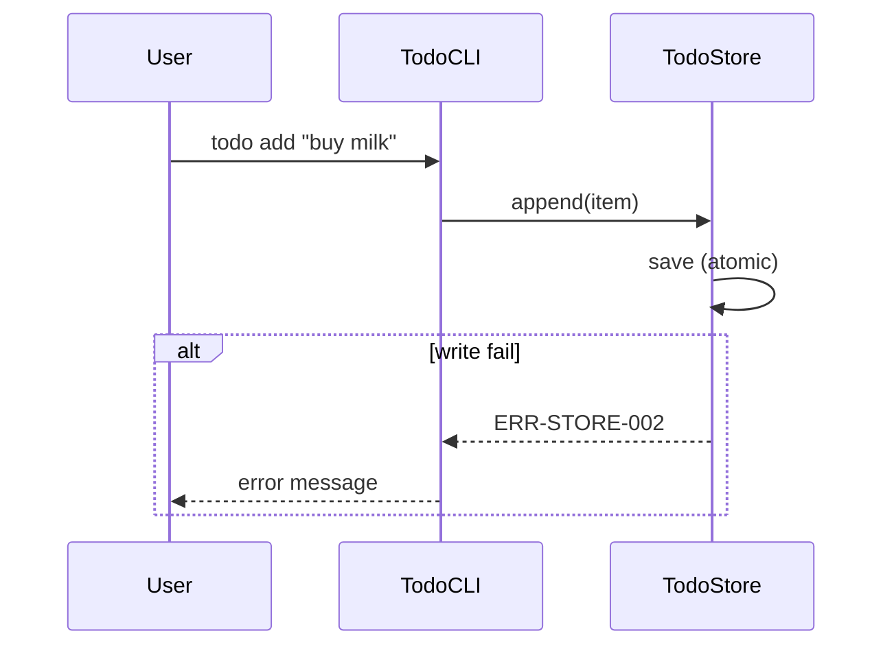
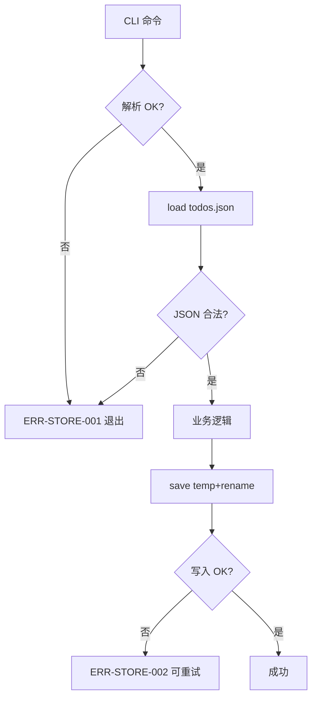
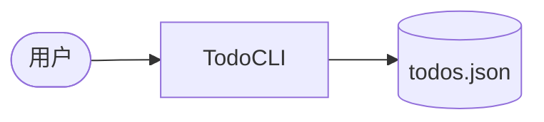

# flow.md — `*.mmd` 格式规格

> **Run 路径：** `docs/factory/runs/<task_id>/flow.mmd`  
> **登记：** `design.json` → `diagrams[]`  
> **校验：** `DES-203`、`DES-214`（[quality-gates.md §4.2](../../quality-gates.md#42-designmd--flowmmd-格式p1)）  
> **对应：** design.md **§4.6 Flow**

---

## 硬性要求（§4.6）

| 要求 | 规则 | Mermaid |
|------|------|---------|
| **时序图** | **必填** ≥1 | `sequenceDiagram` |
| **流程图** | **必填** ≥1 | `flowchart`（含异常/重试分支） |
| 登记 | `diagrams[]` 同时含 `kind: sequence` 与 `kind: flowchart` | 可同文件多段 |
| 解析 | `DES-203` | 开启 validate 时须可解析 |
| 命名 | `DES-204` | participant / 节点 ≡ `modules` / `interfaces` |

流程图 **须** 覆盖至少一条 **异常路径**，并与 §6.2 `error_catalog[].code` 可对应。

---

## 文件约定

| 项 | 约定 |
|----|------|
| 扩展名 | `.mmd`（纯 Mermaid，无 markdown 围栏） |
| 主文件 | `flow.mmd`（推荐 sequence + flowchart 同文件） |
| 可选 | `context.mmd`（§1）、`deploy.mmd`（§9） |

---

## 图类型索引

| `kind` | Mermaid | design.md | 必填 |
|--------|---------|-----------|------|
| `sequence` | `sequenceDiagram` | §4.6 | ✓ |
| `flowchart` | `flowchart` | §4.6 | ✓ |
| `context` | `flowchart` | §1 | 有外部依赖时推荐 |
| `class` | `classDiagram` | §4.4 / §4.5 | P1 |
| `deployment` | `flowchart` | §9 | 服务/链上时 |

---

## sequenceDiagram 模板



---

## flowchart 模板（含异常分支）



---

## context 模板（§1，可选）



---

## diagrams[] 登记示例

```json
{
  "diagrams": [
    { "path": "flow.mmd", "kind": "sequence", "title": "add 命令时序" },
    { "path": "flow.mmd", "kind": "flowchart", "title": "持久化与异常分支" }
  ]
}
```

---

## 实现

- 解析：`multi_agent_code_factory/validators/mermaid.py`
- Architect：**必须** 产出 sequence + flowchart；异常分支对齐 `error_catalog`
